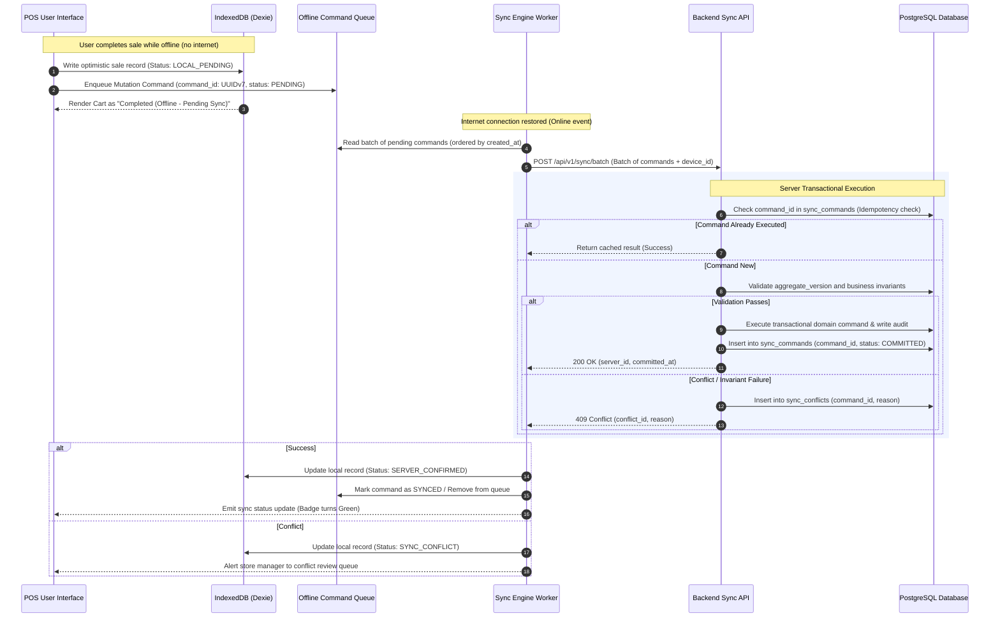

# Super Optical V2 — Offline & Synchronization Architecture

This document specifies the offline-first architecture, local command queue, transactional synchronization protocol, and business conflict resolution strategy for Super Optical V2.

---

## 1. Non-Negotiable Sync Principles

1. **No Naive Last-Write-Wins (LWW)**: Financial, payment, and inventory mutations can never be resolved with simplistic "server timestamp wins" or LWW algorithms.
2. **Authoritative Server Truth**: The server-side PostgreSQL database is the sole arbiter of domain invariants. Client-side IndexedDB is an optimistic working cache and offline command store.
3. **Explicit Sync Status**: The user interface must visually distinguish between:
   - `LOCAL_PENDING`: Mutation exists only on the local device.
   - `SYNCING`: Command is currently in flight to the server.
   - `SERVER_CONFIRMED`: Server has accepted and committed the mutation.
   - `SYNC_CONFLICT`: Mutation violated a business rule or invariant on the server and requires manual resolution.

---

## 2. Architecture & Data Flow



---

## 3. Command Envelope Structure

Every mutation performed offline is encapsulated in an immutable command record:

```typescript
export interface OfflineCommand<T = unknown> {
  commandId: string;        // UUIDv7 (globally unique, time-ordered)
  deviceId: string;         // Registered hardware identifier
  tenantId: string;         // Active tenant context
  storeId: string;          // Store where transaction occurred
  userId: string;           // Staff member who executed action
  commandType: 
    | 'SALE_CREATE'
    | 'SALE_REVISE'
    | 'PAYMENT_RECEIVE'
    | 'STOCK_TRANSFER_DISPATCH'
    | 'STOCK_COUNT_RECORD'
    | 'CUSTOMER_CREATE';
  aggregateId: string;      // Target root aggregate (e.g. sale_id or customer_id)
  aggregateVersion: number; // Version of the aggregate when command was created
  payload: T;               // Complete serialized command parameters
  createdAt: string;        // Client ISO timestamp
  status: 'PENDING' | 'SYNCING' | 'SYNCED' | 'FAILED' | 'CONFLICT';
  retryCount: number;
  lastError?: string;
}
```

---

## 4. Idempotency & Replay Protection

To guarantee that network drops or retry attempts never result in duplicate orders or double payments:
1. **Server Deduplication**: The backend checks `sync_commands` for the inbound `command_id` before acquiring domain locks.
2. **Cached Result Delivery**: If `command_id` was already executed within the past 30 days, the server returns the previously stored HTTP response without re-executing domain actions.
3. **Deterministic Aggregate IDs**: For creations (e.g., creating a new sale), the client generates a deterministic `sale_id` (UUIDv7) packed into the command payload, ensuring relational child entities link correctly offline before upload.

---

## 5. Conflict Resolution Strategy

| Domain | Conflict Scenario | Detection Method | Resolution Policy |
|:---|:---|:---|:---|
| **POS / Sales** | Offline sale created with offline frame stock, but online sale depleted stock in interim. | Aggregate inventory version check at server commit. | **Non-destructive reservation:** Accept payment, create sale in `PROCESSING_EXCEPTION` status. Alert manager to re-order from central store. Stock ledger records emergency negative adjustment with audit tag. |
| **Invoice Edit** | Offline device revises an invoice while manager online applied a payment/discount. | `sale.revision_number` check against client `aggregateVersion`. | **Explicit Conflict:** Command quarantined in `sync_conflicts`. Manager prompted with visual side-by-side diff to merge or reject changes. |
| **Customer Profile** | Customer phone number or address edited concurrently offline. | Field-level modified timestamps. | **Attribute Merge:** Non-conflicting fields merged; conflicting fields use latest verified manager edit. |
| **Payments** | Payment recorded offline against an invoice. | Append-only ledger. | **Always Commits:** Because payments are immutable ledger entries, they are accepted and allocated to the invoice upon sync. |

---

## 6. Device Registration & Verification

1. A device cannot submit sync commands until its `device_id` is formally approved in the `devices` table by a Tenant Administrator.
2. The registration binds the device to a specific `store_id`.
3. Commands arriving from an unregistered or revoked `device_id` are rejected immediately with `403 Device Not Authorized`.
