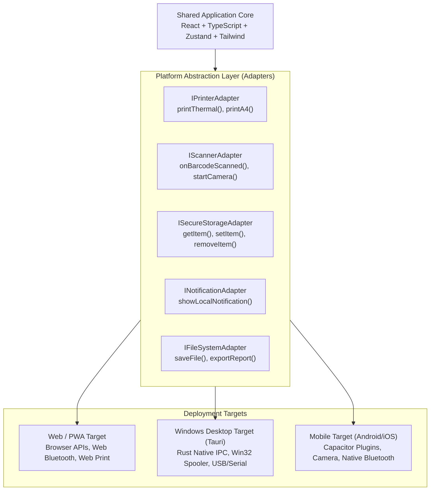

# Super Optical V2 — Platform Architecture

This document specifies the cross-platform runtime architecture, platform adapter interfaces, and hardware abstraction strategy for Super Optical V2.

---

## 1. Single Codebase, Multi-Platform Delivery

Super Optical V2 avoids code duplication across operating systems by implementing the **Platform Adapter Pattern**:



---

## 2. Platform Targets & Runtime Profiles

### 2.1 Web / Progressive Web App (PWA)
- **Primary Use Case:** Back-office administration, optical lab management, remote access from standard laptops and browsers.
- **Service Worker:** Caches application assets (HTML/JS/CSS/fonts) for instant offline startup.
- **Hardware Limitations:** Web browsers cannot access raw USB/serial ports directly without WebUSB/WebSerial (which require user prompts). Printing uses the browser's native `window.print()` dialog with CSS `@media print` rules.

### 2.2 Windows Desktop Application (Tauri)
- **Primary Use Case:** Dedicated in-store POS checkout counters and clinical refraction desks.
- **Runtime:** Lightweight Rust shell hosting the web view (WebView2 on Windows). Consumes minimal memory (<80 MB) compared to Electron (>350 MB).
- **Native Capabilities:**
  - **Direct Thermal Printing:** Rust native binding to Windows Print Spooler (`winspool.drv`) for instant, silent receipt printing without showing print dialogs.
  - **USB/Serial Barcode Scanners:** Raw HID/COM port listening without requiring focused inputs.
  - **Offline Filesystem Access:** Secure local encrypted storage for device credentials.

### 2.3 Mobile Application (Android & iOS via Capacitor)
- **Primary Use Case:** Floor sales staff assisting customers with frame selection, optometrists performing bedside or camp eye exams.
- **Runtime:** Native iOS (WKWebView) and Android (Android System WebView) wrappers powered by Capacitor.
- **Native Capabilities:**
  - **Camera Barcode Scanning:** Integrated camera overlay for rapid frame barcode scanning using `@capacitor-community/barcode-scanner`.
  - **Bluetooth Thermal Printing:** Connects to portable 58mm/80mm ESC/POS belt printers via Bluetooth SPP/BLE.
  - **Secure Storage:** Biometric-backed keychain (iOS) / Keystore (Android) for offline authentication tokens.

---

## 3. Hardware Adapter Interfaces (`@super-optical/printing` & Hardware Module)

Hardware-specific drivers are strictly forbidden inside POS business logic. All interactions pass through standard TypeScript interfaces:

### 3.1 Printer Adapter (`IPrinterAdapter`)
```typescript
export interface PrintJob {
  documentType: 'RECEIPT_THERMAL_80MM' | 'RECEIPT_THERMAL_58MM' | 'INVOICE_A4' | 'LAB_SLIP';
  copies: number;
  data: unknown; // Structured payload
  rawEscPos?: Uint8Array; // Pre-compiled ESC/POS bytes for thermal printers
}

export interface IPrinterAdapter {
  isAvailable(): Promise<boolean>;
  getPrinters(): Promise<Array<{ id: string; name: string; type: 'THERMAL' | 'A4'; isDefault: boolean }>>;
  print(job: PrintJob): Promise<{ success: boolean; error?: string }>;
}
```

### 3.2 Barcode Scanner Adapter (`IScannerAdapter`)
```typescript
export interface IScannerAdapter {
  enable(onBarcode: (barcode: string) => void): void;
  disable(): void;
  startCameraScan(): Promise<string>;
  stopCameraScan(): Promise<void>;
}
```

---

## 4. Responsive Layout Profiles

The UI adapts dynamically to viewport sizes and input modes:

| Platform | Form Factor | Navigation | Interaction Pattern | Key Views |
|:---|:---|:---|:---|:---|
| **Desktop (Windows/Web)** | $\ge 1280\text{ px}$ | Collapsible left sidebar | Mouse & high-speed keyboard shortcuts (`F1`-`F12`, `Enter` navigation) | Dense inventory tables, dual-panel POS with right cart dock, side-by-side refraction charts. |
| **Tablet** | $768\text{ px} - 1279\text{ px}$ | Top compact nav bar | Touch-friendly buttons (min 44px), split 2-column screens | Touch-based frame showcase, customer signature pad for consent, lab QC checklist. |
| **Mobile (Android/iOS)** | $< 768\text{ px}$ | Bottom tab navigation | Touch-first, bottom sheets, full-screen wizard steps | Quick customer lookup, mobile camera scanner, frame catalog cards, order status tracker. |
