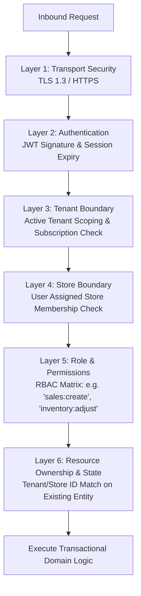

# Super Optical V2 — Security Architecture

This document establishes the security specifications, isolation models, authorization pipelines, and audit standards for Super Optical V2.

---

## 1. Core Security Principle: Non-Trust of Client Input

> [!CAUTION]
> **Client-Supplied Scopes Are Untrusted**: The frontend is NEVER the authority for security.
> `tenant_id`, `store_id`, `role`, and `permissions` provided in client HTTP request bodies, URL query parameters, or route paths are strictly ignored for authorization purposes.
> All security context MUST be extracted server-side from verified, cryptographically signed session tokens.

---

## 2. Six-Tier Authorization Pipeline

Every protected backend API call must be evaluated sequentially through six authorization layers:



### Evaluation Breakdown:
1. **Transport Security**: Enforce HTTPS with TLS 1.3 and HSTS headers.
2. **Authentication**: Verify Bearer JWT signature against server `JWT_SECRET`. Reject expired or revoked tokens.
3. **Tenant Boundary**: Extract `tenant_id` from token payload. Verify tenant is active in database (not suspended or deleted).
4. **Store Boundary**: Extract target `store_id` (from header `X-Store-ID` or request context). Verify user has explicit access to this store via `user_store_access`.
5. **Role & Permission (RBAC)**: Verify user's assigned role possesses the required granular permission (e.g., `sales.create`, `cash.close_register`, `prescriptions.view`).
6. **Resource Ownership**: Before mutating an existing entity (e.g., revising an invoice or editing a prescription), verify that `entity.tenant_id == token.tenant_id` and `entity.store_id == context.store_id`.

---

## 3. Role-Based Access Control (RBAC) Matrix

Super Optical V2 defines hierarchical roles with granular permission assignments:

| Permission Domain | Permission Key | Platform Admin | Tenant Owner | Store Manager | Optometrist | Cashier / Sales | Lab Staff |
|:---|:---|:---:|:---:|:---:|:---:|:---:|:---:|
| **Tenant** | `tenant:manage_settings` | Yes | Yes | - | - | - | - |
| **Stores** | `stores:manage` | Yes | Yes | - | - | - | - |
| **Users** | `users:manage` | Yes | Yes | Yes (Store staff) | - | - | - |
| **Customers** | `customers:create`, `edit` | - | Yes | Yes | Yes | Yes | Read-only |
| **Clinical** | `eye_test:record`, `edit` | - | Yes | - | Yes | - | Read-only |
| **Prescriptions**| `prescriptions:create` | - | Yes | - | Yes | - | Read-only |
| **Catalog** | `products:manage_pricing` | - | Yes | - | - | - | - |
| **Inventory** | `inventory:adjust_stock` | - | Yes | Yes | - | - | - |
| **POS / Sales** | `sales:create`, `checkout` | - | Yes | Yes | - | Yes | - |
| **Invoice Edit**| `sales:revise_invoice` | - | Yes | Yes | - | With approval | - |
| **Refunds** | `payments:issue_refund` | - | Yes | Yes | - | - | - |
| **Cash Register**| `cash:open_close` | - | Yes | Yes | - | Yes | - |
| **Optical Lab** | `lab:update_status` | - | Yes | Yes | - | - | Yes |
| **Reports** | `reports:view_financial` | - | Yes | Yes | - | - | - |

---

## 4. Database Isolation Strategy: Row-Level Security (RLS)

In addition to application-level query scoping (`WHERE tenant_id = :tenantId`), PostgreSQL Row-Level Security (RLS) acts as an unbreakable defense-in-depth barrier:

```sql
-- Enable RLS on core tenant-owned table
ALTER TABLE sales ENABLE ROW LEVEL SECURITY;

-- Create policy enforcing current tenant session variable
CREATE POLICY tenant_isolation_policy ON sales
    FOR ALL
    TO authenticated_role
    USING (tenant_id = current_setting('app.current_tenant_id', true)::uuid)
    WITH CHECK (tenant_id = current_setting('app.current_tenant_id', true)::uuid);
```

When a NestJS database transaction begins, the database service sets the local session variable:
```sql
SET LOCAL app.current_tenant_id = 'tenant-uuid-from-jwt';
```
Any query executed within that transaction is physically incapable of reading or writing rows belonging to another tenant, even if an application bug omitted the `WHERE` clause.

---

## 5. Sensitive Data Handling & Privacy

1. **Clinical Health Records**: Prescriptions and eye examinations are Protected Health Information (PHI). They are strictly scoped to the tenant and store where examination took place, accessible only to authorized medical and sales personnel.
2. **Password Security**: Passwords hashed using Argon2id or bcrypt (cost factor $\ge 12$).
3. **Payment Card Industry (PCI) Compliance**: The application NEVER stores raw credit card numbers, CVVs, or bank account PINs. Only transaction references and authorization IDs returned by certified payment gateways or UPI providers are stored.

---

## 6. Audit Logging Architecture

Every security-sensitive event emits an immutable record to the `audit_logs` table:
- **Event Attributes:** `id`, `tenant_id`, `store_id`, `user_id`, `device_id`, `ip_address`, `user_agent`, `action`, `resource_type`, `resource_id`, `before_state` (JSONB), `after_state` (JSONB), `timestamp`.
- **Monitored Events:** User login/logout, password change, permission changes, stock adjustments, invoice revisions, refund issuance, cash register closing discrepancies, and offline conflict overrides.
- **Immutability:** The `audit_logs` table has database rules preventing `UPDATE` and `DELETE` operations.
