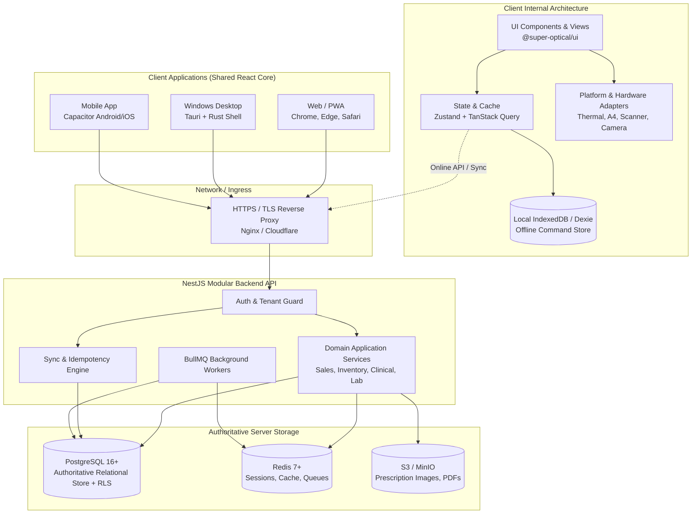
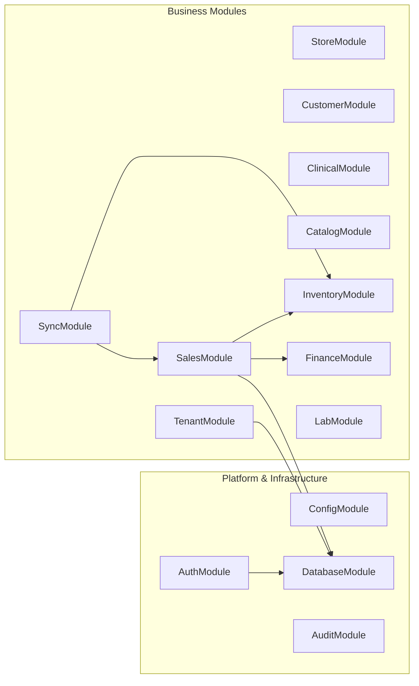
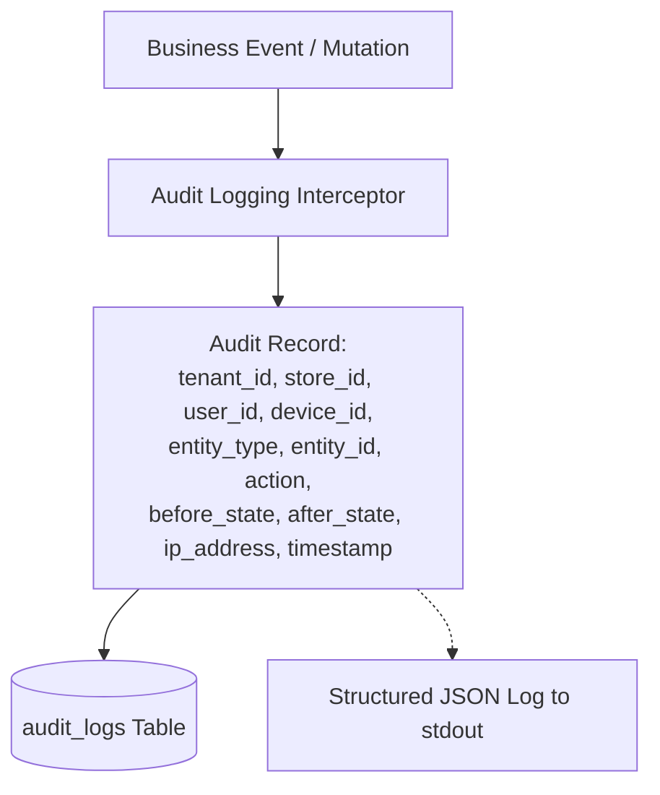

# Super Optical V2 — System Architecture

This document defines the overarching system architecture, module boundaries, data flows, and runtime topology for Super Optical V2.

---

## 1. High-Level System Topology

Super Optical V2 follows a clean, decoupled architecture: a unified React/TypeScript client core deployed to multiple targets (Web/PWA, Windows Desktop via Tauri, Mobile via Capacitor), communicating with a modular NestJS backend, backed by PostgreSQL, Redis, and Object Storage.



---

## 2. Shared Packages Architecture

To prevent duplicate business logic and calculation divergence, core logic is encapsulated in pure TypeScript packages consumed across clients and the backend:

```mermaid
graph TD
    subgraph SharedPackages["Monorepo Shared Packages"]
        types["@super-optical/types<br/>Entities, DTOs, Enums"]
        validation["@super-optical/validation<br/>Zod Schemas"]
        calculations["@super-optical/calculations<br/>Prices, Discounts, Totals"]
        optical["@super-optical/optical<br/>Rx Formulas, Transposition"]
        tax["@super-optical/tax<br/>GST Rules, Tax Schedules"]
        sync["@super-optical/sync<br/>Sync Protocol, Command Types"]
        ui["@super-optical/ui<br/>Design System, Components"]
        printing["@super-optical/printing<br/>ESC/POS, Receipt Layouts"]
    end

    apps_web[apps/web] --> types
    apps_web --> validation
    apps_web --> calculations
    apps_web --> optical
    apps_web --> tax
    apps_web --> sync
    apps_web --> ui
    apps_web --> printing

    apps_desktop[apps/desktop] --> types
    apps_desktop --> ui
    apps_desktop --> printing

    apps_mobile[apps/mobile] --> types
    apps_mobile --> ui

    backend_api[backend/api] --> types
    backend_api --> validation
    backend_api --> calculations
    backend_api --> optical
    backend_api --> tax
    backend_api --> sync
```



---

## 3. Backend Modular Architecture (NestJS)

The backend is built around discrete domain modules, strictly eliminating monolithic service files:



### Module Responsibilities:
- **AuthModule**: Issues/verifies JWT tokens, resolves tenant membership, verifies active session.
- **TenantGuard / StoreGuard**: Enforces multi-tenant context and user store permissions on every request.
- **SalesModule**: Orchestrates atomic sales, cart validation, invoice creation, and revision management.
- **InventoryModule**: Executes ledger-driven stock movements, transfers, purchase receipts, and audit adjustments.
- **FinanceModule**: Manages payments, allocations, refunds, customer credits/debits, and cash register sessions.
- **SyncModule**: Ingests offline command batches, enforces idempotency, executes transactional commands, and queues conflicts.

---

## 4. Request Lifecycle & Security Boundary

Every HTTP request to a protected endpoint must pass through a strict security pipeline:

```mermaid
sequenceDiagram
    autonumber
    participant Client as Client Application
    participant Guard as Auth & Tenant Guard
    participant Ctx as Request Context
    participant Service as Domain Service
    participant DB as PostgreSQL (with RLS)

    Client->>Guard: POST /api/v1/sales (Bearer Token + Payload)
    Note over Guard: Verify JWT signature & expiration
    Guard->>Ctx: Extract user_id, tenant_id, allowed_store_ids, role, permissions
    Note over Guard: Validate store_id in payload belongs to user's allowed_store_ids
    Guard->>Service: Forward request with validated ExecutionContext
    Note over Service: Client-supplied tenant_id/store_id ignored; Context values used
    Service->>DB: BEGIN TRANSACTION (SET LOCAL app.current_tenant_id = ...)
    Service->>DB: Execute normalized queries & ledger insertions
    DB-->>Service: Commit OK
    Service-->>Client: 201 Created (Authoritative Sale Response)
```

---

## 5. Observability and Audit Architecture

Every mutation to clinical, financial, inventory, or security state triggers an immutable audit log entry.



1. **Structured Logging**: All logs are emitted in JSON format with correlation IDs (`correlation_id`, `tenant_id`, `user_id`).
2. **Audit Trails**: Stored in PostgreSQL `audit_logs` table (partitioned by month for long-term compliance).
3. **Health Checks**: `/health`, `/health/ready`, and `/health/live` endpoints monitored for container orchestration.
