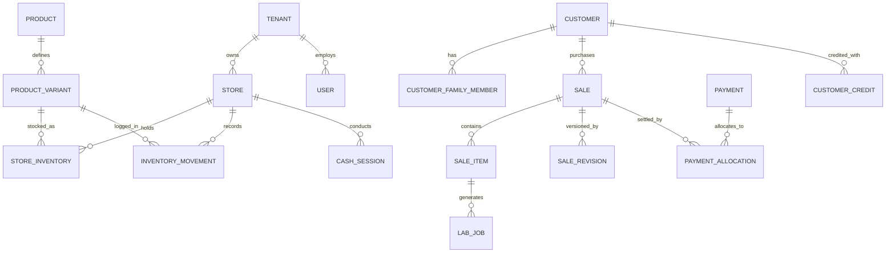

# Super Optical V2 — Database Architecture & Financial Integrity Design

This document specifies the relational database architecture for PostgreSQL 16+, detailing tenant partitioning, append-only ledger designs, and financial integrity constraints.

---

## 1. Database Architecture Principles

1. **Normalized Relational Model**: JSON blobs are strictly prohibited for storing financial line items, inventory records, or customer contact data.
2. **Append-Only Financial & Inventory Ledgers**: Stock counts and customer payment balances are backed by immutable transaction ledgers.
3. **Multi-Tenant Data Partitioning**: All tenant-owned tables include a non-nullable `tenant_id UUID` column indexed and protected via PostgreSQL Row-Level Security (RLS).
4. **Deterministic Primary Keys**: UUIDv7 is used for all primary keys to guarantee distributed uniqueness and chronological B-Tree indexing performance across offline clients and the server.

---

## 2. Core Relational Schema Topology



---

## 3. Financial Integrity & Append-Only Ledgers

### 3.1 Ten Immutable Financial Principles
1. **Payments are Transactions, Not Invoice Columns**: An invoice row does not have an in-place mutable `amount_paid` field. Total paid is calculated as $\sum(\text{allocated\_amount})$.
2. **Ledger-Driven Inventory**: Every change in physical stock MUST create an immutable row in `inventory_movements`.
3. **Traceable Movement Types**: Every stock movement requires an explicit business event code (`PURCHASE_RECEIPT`, `SALE_DEDUCTION`, `SALE_REVERSAL`, `TRANSFER_IN`, `TRANSFER_OUT`, `DAMAGE`, `STOCK_ADJUSTMENT`).
4. **Financial History Cannot Be Overwritten**: If an incorrect payment is entered, a compensating refund or correction transaction must be recorded.
5. **Revision-Based Invoice Edits**: Modifying a confirmed sale creates a new `sale_revisions` record capturing the reason, user, prior snapshot, and differential financial/inventory adjustments.
6. **Explicit Refunds**: Refunds are distinct financial transactions linked to original payment allocations and cash session drawers.
7. **Explicit Customer Credits & Debits**: If an invoice total is revised downwards after payment, the surplus is deposited into the customer's credit ledger (`customer_credits`).
8. **Idempotent Sync Mutations**: Commands submitted from offline devices include client-generated UUIDv7 keys to reject duplicate processing.
9. **Atomic Checkout Engine**: A sale transaction bundles customer check, price calculation, tax computation, invoice creation, inventory deduction, and payment allocation into an atomic database transaction.
10. **Deterministic Mathematical Precision**: All currency amounts are stored in cents/paise as `BIGINT` or `NUMERIC(14, 2)` to eliminate floating-point rounding errors.

---

## 4. Key Table DDL Designs (Blueprint for Phase 1+)

### 4.1 Store Inventory & Movement Ledger
```sql
-- Current stock snapshot table (read-optimized)
CREATE TABLE store_inventory (
    tenant_id UUID NOT NULL,
    store_id UUID NOT NULL,
    product_variant_id UUID NOT NULL,
    quantity_on_hand INTEGER NOT NULL DEFAULT 0,
    quantity_reserved INTEGER NOT NULL DEFAULT 0,
    reorder_level INTEGER NOT NULL DEFAULT 5,
    updated_at TIMESTAMPTZ NOT NULL DEFAULT NOW(),
    PRIMARY KEY (tenant_id, store_id, product_variant_id)
);

-- Immutable movement ledger (source of truth)
CREATE TABLE inventory_movements (
    id UUID PRIMARY KEY DEFAULT gen_random_uuid(),
    tenant_id UUID NOT NULL,
    store_id UUID NOT NULL,
    product_variant_id UUID NOT NULL,
    movement_type VARCHAR(32) NOT NULL, -- 'PURCHASE_RECEIPT', 'SALE_DEDUCTION', etc.
    quantity_change INTEGER NOT NULL,    -- Positive for in, negative for out
    balance_after INTEGER NOT NULL,
    reference_type VARCHAR(32) NOT NULL, -- 'SALE', 'PURCHASE_ORDER', 'ADJUSTMENT'
    reference_id UUID NOT NULL,
    reason_code VARCHAR(64),
    performed_by_user_id UUID NOT NULL,
    created_at TIMESTAMPTZ NOT NULL DEFAULT NOW()
);
CREATE INDEX idx_inv_mov_audit ON inventory_movements(tenant_id, store_id, product_variant_id, created_at);
```

### 4.2 Payments & Allocation Engine
```sql
-- Payments as discrete financial transactions
CREATE TABLE payments (
    id UUID PRIMARY KEY DEFAULT gen_random_uuid(),
    tenant_id UUID NOT NULL,
    store_id UUID NOT NULL,
    customer_id UUID NOT NULL,
    cash_session_id UUID, -- Links to drawer session if cash
    payment_method VARCHAR(24) NOT NULL, -- 'CASH', 'UPI', 'CARD', 'CUSTOMER_CREDIT'
    amount NUMERIC(14, 2) NOT NULL CHECK (amount > 0),
    transaction_reference VARCHAR(128),  -- Gateway tx ID or UPI UTR
    status VARCHAR(24) NOT NULL DEFAULT 'COMPLETED', -- 'COMPLETED', 'REVERSED', 'REFUNDED'
    received_by_user_id UUID NOT NULL,
    created_at TIMESTAMPTZ NOT NULL DEFAULT NOW()
);

-- Many-to-many allocation of payments to sales
CREATE TABLE payment_allocations (
    id UUID PRIMARY KEY DEFAULT gen_random_uuid(),
    tenant_id UUID NOT NULL,
    payment_id UUID NOT NULL REFERENCES payments(id),
    sale_id UUID NOT NULL REFERENCES sales(id),
    amount_allocated NUMERIC(14, 2) NOT NULL CHECK (amount_allocated > 0),
    allocated_at TIMESTAMPTZ NOT NULL DEFAULT NOW()
);
```

### 4.3 Revision-Based Invoice Lifecycle
```sql
CREATE TABLE sale_revisions (
    id UUID PRIMARY KEY DEFAULT gen_random_uuid(),
    tenant_id UUID NOT NULL,
    sale_id UUID NOT NULL REFERENCES sales(id),
    revision_number INTEGER NOT NULL,
    reason VARCHAR(255) NOT NULL,
    revised_by_user_id UUID NOT NULL,
    previous_subtotal NUMERIC(14, 2) NOT NULL,
    new_subtotal NUMERIC(14, 2) NOT NULL,
    previous_tax_amount NUMERIC(14, 2) NOT NULL,
    new_tax_amount NUMERIC(14, 2) NOT NULL,
    previous_total_amount NUMERIC(14, 2) NOT NULL,
    new_total_amount NUMERIC(14, 2) NOT NULL,
    financial_delta NUMERIC(14, 2) NOT NULL, -- new_total - previous_total
    created_at TIMESTAMPTZ NOT NULL DEFAULT NOW()
);
CREATE UNIQUE INDEX idx_sale_revision ON sale_revisions(sale_id, revision_number);
```
