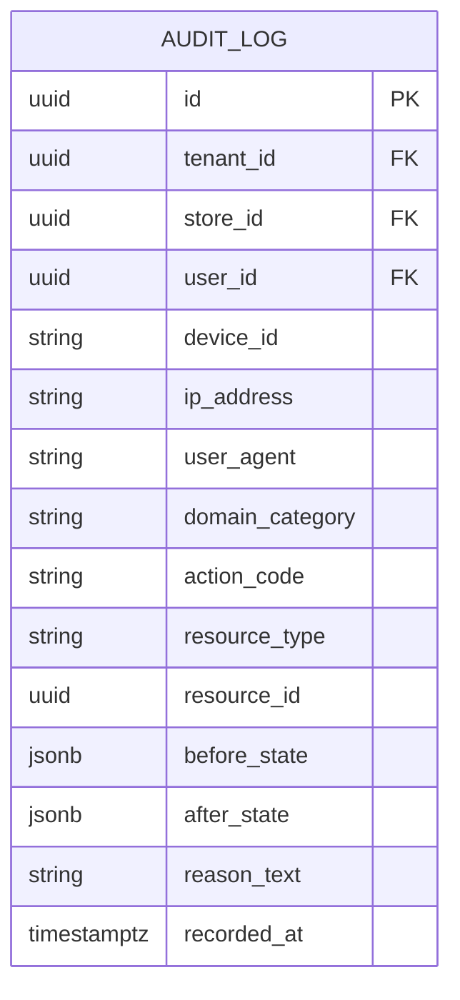

# Domain: Audit Trail & Compliance Logging

**Document Version:** 1.0.0  
**Phase:** Phase 1 — Product Definition & Business Requirements  
**Domain Code:** `28-AUDIT`  

---

## 1. Domain Scope: Immutable Operational Traceability

The **Audit Trail** domain enforces end-to-end accountability across Super Optical V2. Every critical clinical, financial, inventory, security, and configuration mutation generates an unalterable audit log entry detailing who did what, when, where, and why.

> [!CAUTION]
> **Audit Immutability Invariant**  
> Audit log rows are strictly write-once (`INSERT` only). The database engine strictly rejects `UPDATE` and `DELETE` queries on the `audit_logs` table via database trigger rules.

---

## 2. Monitored Audit Event Taxonomy

| Event Domain | Action Codes | Captured Audit Data |
|:---|:---|:---|
| **Security & Auth** | `LOGIN_SUCCESS`, `LOGIN_FAILED`, `LOGOUT`, `PASSWORD_CHANGED`, `SESSION_REVOKED`, `DEVICE_AUTHORIZED` | User ID, Device ID, IP Address, User Agent, Timestamp. |
| **RBAC & Staff** | `USER_CREATED`, `ROLE_ASSIGNED`, `PERMISSION_CHANGED`, `STORE_ACCESS_MODIFIED` | Admin User ID, Target User ID, Previous Permissions, New Permissions. |
| **Customer Data** | `CUSTOMER_CREATED`, `CUSTOMER_EDITED`, `PHONE_CHANGED`, `CUSTOMER_DELETED` | User ID, Customer ID, Changed Fields (Before/After JSONB). |
| **Clinical & Rx** | `EXAMINATION_FINALIZED`, `PRESCRIPTION_ISSUED`, `PRESCRIPTION_AMENDED` | Optometrist User ID, Customer ID, Prior SPH/CYL, New SPH/CYL. |
| **Inventory** | `STOCK_ADJUSTED`, `STOCK_TRANSFERRED`, `DAMAGE_WRITTEN_OFF`, `COUNT_VARIANCE_LOGGED` | User ID, Store ID, Variant SKU, Delta Quantity, Reason Code. |
| **Sales & Invoice**| `SALE_CONFIRMED`, `INVOICE_REVISED`, `SALE_CANCELLED`, `DISCOUNT_OVERRIDDEN` | User ID, Manager Approver ID, Sale ID, Revision Number, Financial Delta. |
| **Payments** | `PAYMENT_RECEIVED`, `REFUND_ISSUED`, `CREDIT_DISBURSED`, `ALLOCATION_REVERSED` | Cashier User ID, Payment Method, Amount, Transaction Reference. |
| **Cash Drawer** | `DRAWER_OPENED`, `MANUAL_KICK`, `DAY_CLOSED`, `VARIANCE_APPROVED` | Cashier ID, Manager ID, Expected vs Actual Cash, Reason. |
| **Sync Engine** | `OFFLINE_COMMAND_COMMITTED`, `SYNC_CONFLICT_DETECTED`, `CONFLICT_RESOLVED` | Device ID, Command ID, Conflict Resolution Action. |

---

## 3. Audit Record Schema Specification

---

## 4. Retention, Compliance & Searchability

1. **Partitioning:** The `audit_logs` table is partitioned by month (`recorded_at`) to ensure query performance and facilitate archival.
2. **Read-Only Audit Viewer:** Tenant Administrators and Owners can query audit trails with multi-parameter filtering (by User, Date Range, Action, Store, and Resource ID).
3. **Legal Compliance:** Audit logs are preserved for a minimum of 7 years to satisfy Indian tax and medical record statutory requirements.
