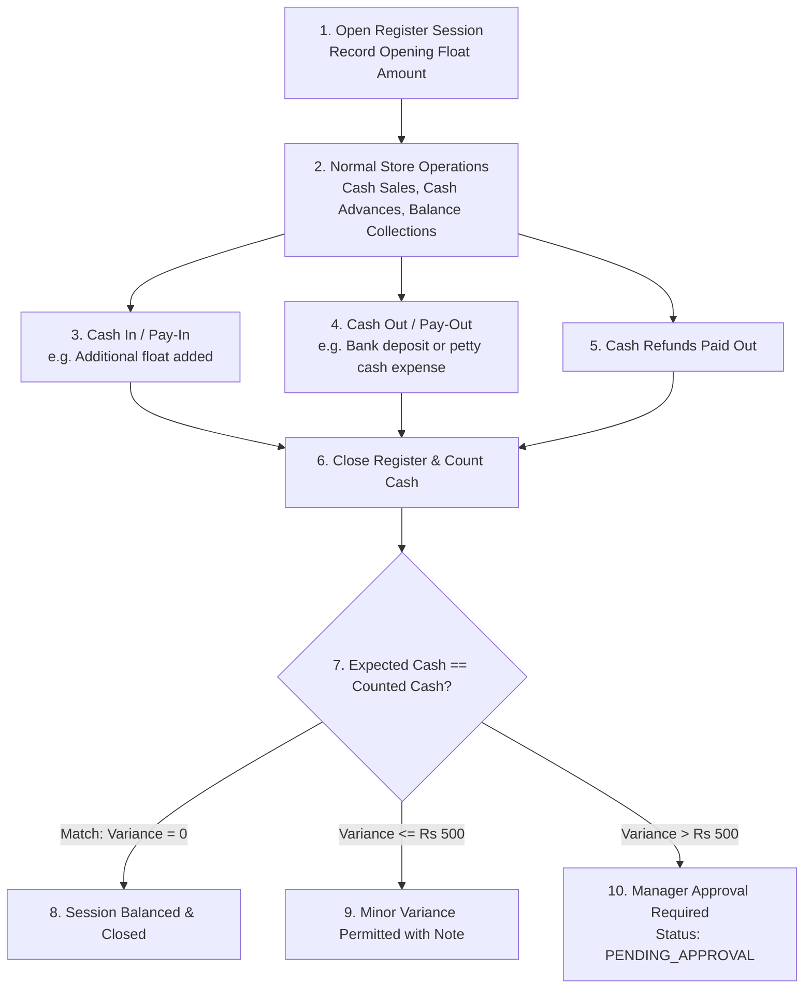
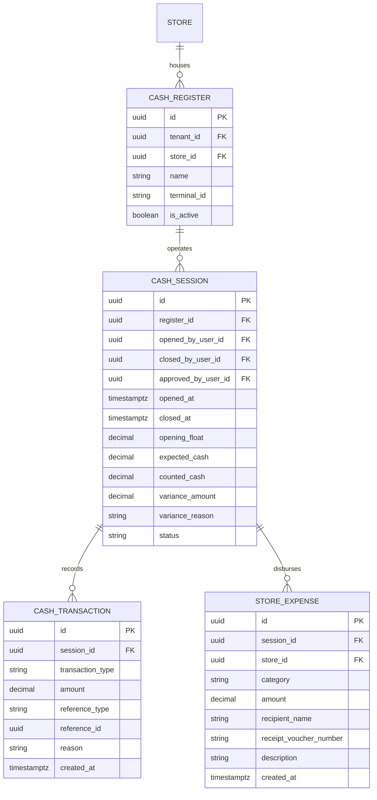

# Domain: Cash Register & Store Expense Management

**Document Version:** 2.0.0  
**Phase:** Phase 1 — Product Definition & Business Requirements  
**Domain Code:** `24-CASH-REGISTER` / `25-EXPENSES`  
**Status:** Approved Specification (DEC-017 Approved)  

---

## 1. Domain Scope & Reconciliation Objectives

The **Cash Register & Store Expenses** domain enforces store-level cash reconciliation, physical drawer accountability, shift management, and petty cash expense tracking. It ensures that every physical rupee inside the optical store counter is accounted for from opening float to evening closing.

---

## 2. Cash Session Lifecycle & Reconciliation Formula

### The Expected Cash Invariant Formula:
$$\text{Expected Cash} = \text{Opening Float} + \sum(\text{Cash Sales}) + \sum(\text{Cash Advances}) + \sum(\text{Cash In}) - \sum(\text{Cash Refunds}) - \sum(\text{Petty Cash Expenses}) - \sum(\text{Cash Out})$$
$$\text{Cash Variance} = \text{Actual Physical Cash Counted} - \text{Expected Cash}$$

---

## 3. Cash Register Entities

---

## 4. Cash Denomination Breakdown at Day Close

To prevent loose estimations, the closing screen prompts the cashier to enter physical counts for standard Indian currency denominations:

$$\text{Counted Cash} = (N_{500} \times 500) + (N_{200} \times 200) + (N_{100} \times 100) + (N_{50} \times 50) + (N_{20} \times 20) + (N_{10} \times 10) + \text{Coins}$$

The breakdown is stored as an immutable audit record in the session data.

---

## 5. Cash Variance Threshold & Manager Approval Workflow (DEC-017)

To balance cashier operational flow with financial accountability, cash drawer closing enforces an approved two-tier variance policy:

| Variance Condition | Operational Action | Required Approvals | Session Final Status |
|:---|:---|:---:|:---:|
| **Zero Variance** ($\text{Variance} = 0$) | Immediate standard closing | Cashier | `CLOSED` |
| **Minor Variance** ($0 < \|\text{Variance}\| \le ₹500$) | Cashier records descriptive reason note; system logs variance to audit ledger | Cashier | `CLOSED` |
| **Excessive Variance** ($\|\text{Variance}\| > ₹500$) | Cashier enters mandatory reason; session flagged; manager notification dispatched | Store Manager or Owner | `PENDING_APPROVAL` $\rightarrow$ `CLOSED` |

### Key Variance Rules:
1. **Configurable Default:** The threshold is initialized at **₹500** per session by default and is admin-configurable per store or tenant.
2. **Mandatory Manager Approval:** If the counted cash differs from expected cash by more than ₹500 (shortage or surplus), the session cannot transition to `CLOSED` without a manager's cryptographic signature or authenticated approval.
3. **Immutable Audit Record:** Every variance record captures the cashier ID, manager approver ID, expected amount, counted amount, variance delta, denomination counts, timestamp, and explanation text.

---

## 6. Store Petty Cash & Expense Logging

Optical retail stores frequently disburse cash from the drawer for operational necessities:
- **Eligible Expense Categories:** Store Cleaning Supplies, Staff Tea/Refreshments, Local Delivery Travel, Minor Hardware Repair, Postage/Courier, Electricity Bill.
- **Workflow:**
  1. Cashier enters amount and selects Expense Category.
  2. Enters payee name and optional physical voucher number.
  3. System logs `CASH_OUT` transaction reducing active session cash.
  4. Day closing report itemizes total petty cash disbursements alongside gross sales.
