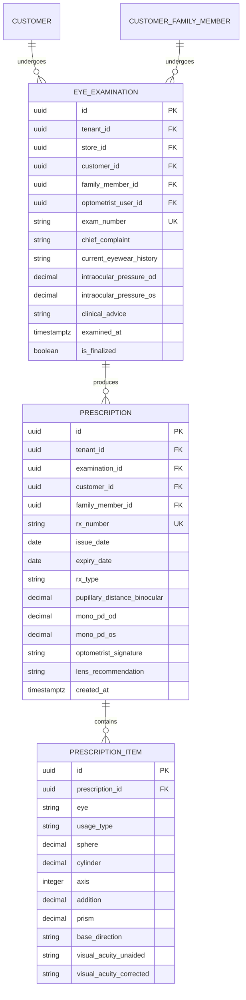

# Domain: Clinical Optical & Prescription Management

**Document Version:** 1.0.0  
**Phase:** Phase 1 — Product Definition & Business Requirements  
**Domain Code:** `08-CLINICAL` / `09-PRESCRIPTION`  

---

## 1. Domain Scope: Dedicated Optical Refraction (Non-Hospital)

> [!IMPORTANT]
> **Pure Optical Clinical Refraction**  
> This domain is exclusively designed for optical optometrists and dispensing opticians.
> It models refractive vision correction, subjective and objective trial lens testing, and spectacle/contact lens prescriptions.
> It deliberately **excludes** hospital inpatient records, surgical scheduling, radiology, systemic pathology, and general nursing notes.

---

## 2. Core Principles & Clinical Invariants

1. **Immutable Clinical History**: Once an optometrist finalizes and signs an eye examination or optical prescription, the record becomes **immutable**. Creating a new sale, returning an order, or conducting a follow-up test **never overwrites** historical clinical records.
2. **Clinical-to-Commercial Traceability**:
   $$\text{Customer} \longrightarrow \text{Eye Examination} \longrightarrow \text{Prescription} \longrightarrow \text{POS Cart Line Item}$$
   A sales order line item for prescription spectacles references the exact prescription version used to edge the lenses.
3. **Bi-Ocular Notation**: Both eyes are recorded separately using international ophthalmic notation:
   - **OD (Oculus Dexter):** Right Eye
   - **OS (Oculus Sinister):** Left Eye
   - **OU (Oculi Uterque):** Both Eyes (used for binocular visual acuity or PD)

---

## 3. Optical Measurements & Entity Models

---

## 4. Detailed Clinical Parameters

### 4.1 Refraction Parameters
- **Sphere (SPH):** Diopter power ranging from $-25.00\text{ D}$ to $+25.00\text{ D}$ in $0.25\text{ D}$ steps (e.g. $-2.25$, $+1.50$, Plan / $0.00$).
- **Cylinder (CYL):** Astigmatic corrective power ranging from $-10.00\text{ D}$ to $+10.00\text{ D}$ in $0.25\text{ D}$ steps.
- **Axis:** Astigmatic angle ranging from $1^\circ$ to $180^\circ$ in $1^\circ$ increments (mandatory whenever Cylinder $\neq 0.00$).
- **Addition (ADD):** Near-vision bifocal/progressive addition ranging from $+0.75\text{ D}$ to $+4.00\text{ D}$ in $0.25\text{ D}$ steps.
- **Pupillary Distance (PD):** 
  - Binocular PD: Total distance between pupil centers in millimeters (e.g., $62.0\text{ mm}$, range $45 - 75\text{ mm}$).
  - Monocular PD: Distance from bridge center to right/left pupil (e.g., OD: $31.0\text{ mm}$, OS: $31.5\text{ mm}$).
- **Prism & Base:** Prism diopters ($0.25\text{ }^\Delta$ to $10.00\text{ }^\Delta$) with base orientation (`BASE_UP`, `BASE_DOWN`, `BASE_IN`, `BASE_OUT`).
- **Visual Acuity (VA):** Snellen or LogMAR fraction (e.g., `6/6`, `6/9`, `6/12`, `6/18`, `6/60`, `20/20`, `20/40`).

### 4.2 Auto-Transposition Utility
The system includes built-in optical formula transposition between Minus Cylinder and Plus Cylinder forms:
$$\text{SPH}_{\text{new}} = \text{SPH}_{\text{old}} + \text{CYL}_{\text{old}}$$
$$\text{CYL}_{\text{new}} = -\text{CYL}_{\text{old}}$$
$$\text{Axis}_{\text{new}} = (\text{Axis}_{\text{old}} + 90^\circ) \pmod{180^\circ} \quad (\text{if } 0^\circ \rightarrow 180^\circ)$$

---

## 5. Prescription Lifecycle & Digital Card Generation

1. **Recording & Validation:** Optometrist inputs values. The validation engine verifies that Axis is provided when Cylinder is non-zero, and flags high anisometropia ($> 2.50\text{ D}$ difference between eyes) for verification.
2. **Finalization:** The optometrist signs off. The system generates a formatted, high-resolution Digital Optical Prescription Card with barcode, practice header, and legal disclaimer.
3. **Sharing:** The card can be printed as a pocket card or shared via WhatsApp/SMS link.
4. **Sales Attachment:** When sales staff builds an optical order at POS, the customer's active prescriptions are displayed for single-click attachment to the chosen frame and lenses.
