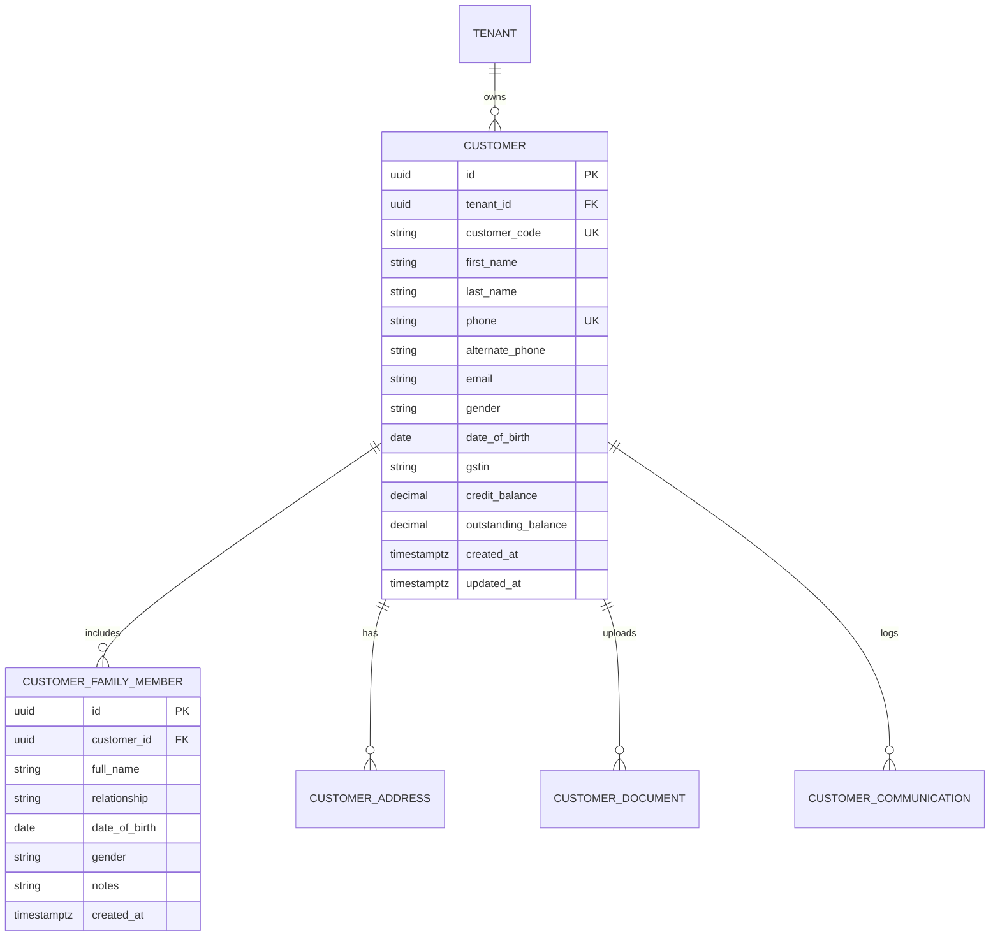

# Domain: Customer & Family Management

**Document Version:** 1.0.0  
**Phase:** Phase 1 — Product Definition & Business Requirements  
**Domain Code:** `06-CUSTOMERS` / `07-FAMILY`  

---

## 1. Domain Overview & Invariants

The **Customer & Family Management** domain manages customer profiles, family member trees, contact details, communication preferences, and links to clinical and purchase histories.

### Critical Invariants:
1. **Separation from Transactions:** Customer master records are decoupled from financial records. Modifying customer profile attributes (e.g. phone, address) never mutates historical invoices or fiscal receipts.
2. **Tenant Scoping:** Customer phone numbers and profiles are scoped strictly to the owning Tenant. Customer records are shared across all stores operated by that tenant.
3. **Primary vs Dependent:** A Customer account represents the primary legal/billing entity (with unique primary phone number). Family members (`customer_family_members`) link to the primary account for unified billing and communication, but maintain distinct clinical prescriptions and order records.
4. **Duplicate Prevention:** The registration interface must enforce fuzzy and exact phone number deduplication to prevent fragmented customer histories.

---

## 2. Core Entities & Relationships

---

## 3. Key Functional Workflows

### 3.1 Customer Search & Duplicate Detection
- **Input:** 10-digit mobile number, full name, or customer code.
- **Deduplication Logic:**
  1. Exact phone match triggers immediate retrieval of existing customer profile.
  2. If partial match (e.g., matching last name and address), the system presents existing profiles with an option: *"Link as family member to existing account"* or *"Create independent customer"*.

### 3.2 Family Member Association
- An existing customer visits with their spouse or child.
- Staff creates a `customer_family_members` record linked to the primary account.
- When an eye test is conducted or spectacles are purchased, the sale and prescription explicitly reference `family_member_id`.
- Invoices and payment receipts are addressed to the primary customer, but optical specifications clearly state the family member's name.

### 3.3 Financial Summary View
- Customer profile displays a real-time summary derived from financial ledgers:
  - **Total Lifetime Value (LTV):** Sum of completed sales.
  - **Active Credit Balance:** Unallocated customer advance deposits or refund credits available for future checkout.
  - **Outstanding Balance:** Total unpaid balance across confirmed/delivered sales.

### 3.4 Communication & Privacy Consents
- Stores explicit opt-in preferences for WhatsApp order ready updates, promotional optical reminders, and recall eye exam alerts.
- Customer documents (e.g. external doctor prescriptions, insurance cards) can be securely stored in object storage with tenant-isolated access links.
