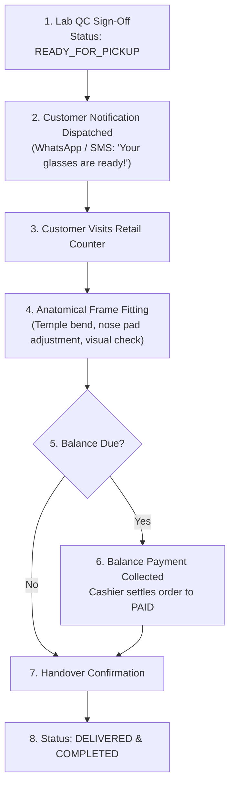

# Domain: Customer Handover & Delivery Management

**Document Version:** 1.0.0  
**Phase:** Phase 1 — Product Definition & Business Requirements  
**Domain Code:** `23-DELIVERY`  

---

## 1. Domain Scope: In-Store Pickup & Dispensing Handover

> [!NOTE]
> **Focused Retail Handover Scope**  
> In standard optical retail operations, over 95% of eyewear deliveries occur via **In-Store Customer Pickup** at the retail dispensing desk.  
> Third-party parcel courier logistics is excluded unless explicitly requested for home delivery.

The **Delivery Management** domain tracks orders from the moment they pass workshop Quality Control (`READY_FOR_PICKUP`) through final visual verification, physical fitting on the customer's face, and balance settlement.

---

## 2. Customer Delivery Lifecycle

---

## 3. Delivery States & Handling Scenarios

| Status | Description | Trigger / Action |
|:---|:---|:---|
| `READY_FOR_PICKUP` | Spectacles packaged in case with cleaning cloth; located in store pickup tray. | Triggered automatically when Lab Job passes QC. |
| `CUSTOMER_NOTIFIED`| Automated WhatsApp / SMS sent with store hours and balance due. | Dispatched via notification queue. |
| `PARTIALLY_DELIVERED`| Multi-item family order where 1 pair of glasses is ready while second is in edging. | Customer collects ready item; balance adjusted proportionally. |
| `DELIVERED` | Customer tried on glasses, verified vision, settled balance, and took delivery. | Staff signs off digital handover. |
| `PICKUP_OVERDUE` | Customer has not collected order 14 days after notification. | Triggers automated reminder message or staff phone follow-up. |
| `DELIVERY_CANCELLED`| Customer rejects spectacles due to non-adaptation or defect. | Order routed to clinical re-examination or refund workflow. |

---

## 4. Optical Handover Verification Checklist

Upon physical delivery, the dispensing optician or sales associate performs:
1. **Visual Clarity Confirmation:** Customer looks through distance and near zones to confirm comfortable vision.
2. **Four-Point Anatomical Fit:**
   - Nose pads sit flush against nasal bone without pinching.
   - Temples follow ear contour without excessive pressure.
   - Spectacles sit horizontally level without tilting.
   - Vertex distance ($12 - 14\text{ mm}$) and pantoscopic tilt ($7^\circ - 10^\circ$) verified.
3. **Care Kit Provision:** Customer handed microfiber cloth, optical lens cleaning instructions, and warranty card.
4. **Digital Signature / Handover Sign-Off:** Customer signs on mobile/tablet counter screen or receives digital delivery confirmation SMS.
