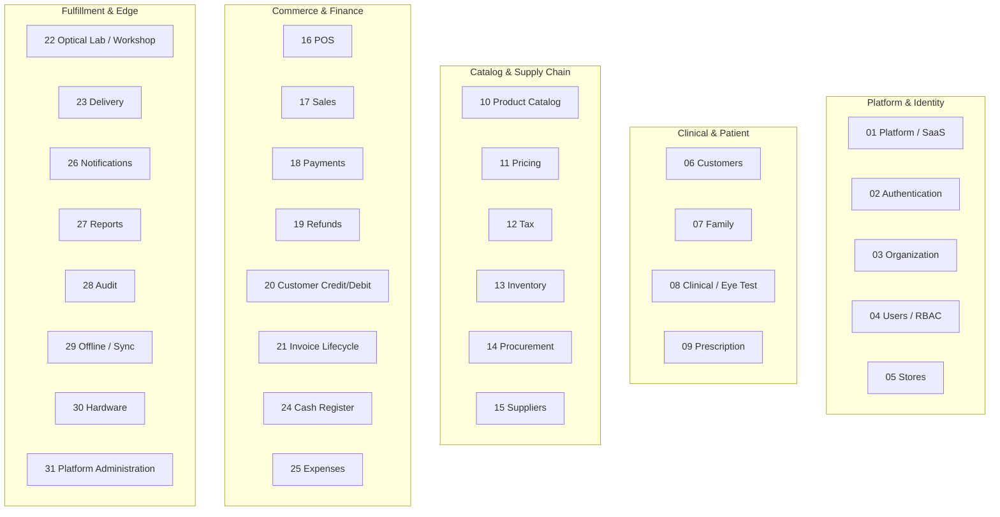

# Super Optical V2 — Domain Boundaries & Entity Ownership

This document defines the 31 functional domains of Super Optical V2, establishing strict entity ownership, domain invariants, and inter-domain communication boundaries.

---

## 1. Domain Ownership Map

---

## 2. Granular Domain Specifications (01 to 31)

### 01 Platform / SaaS
- **Owner of:** `tenants`, `tenant_settings`, `subscription_plans`, `tenant_subscriptions`, `tenant_features`.
- **Invariants:** Tenant isolation is absolute. Tenant features dictate active capability flags.

### 02 Authentication
- **Owner of:** Password hashes, refresh tokens, active session states.
- **Invariants:** Issues cryptographically signed JWTs containing tenant and user claims.

### 03 Organization
- **Owner of:** Company profile, legal business entity, tax registrations (GSTIN), business hours.

### 04 Users / Roles / Permissions (RBAC)
- **Owner of:** `users`, `roles`, `permissions`, `role_permissions`, `user_store_access`.
- **Invariants:** No user can perform actions across multiple stores unless explicitly granted via `user_store_access`.

### 05 Stores
- **Owner of:** `stores`, store addresses, store-specific invoice sequence counters.

### 06 Customers
- **Owner of:** `customers`, `customer_addresses`, `customer_notes`, `customer_consents`.
- **Invariants:** Primary phone number must be unique per tenant.

### 07 Family
- **Owner of:** `customer_family_members`.
- **Invariants:** Family members can link to the primary billing customer while maintaining independent medical refraction histories.

### 08 Clinical / Eye Examination
- **Owner of:** `eye_examinations`, visual acuity measurements, intraocular pressure (IOP), refraction history.
- **Invariants:** Clinical examination records become immutable once finalized by the optometrist.

### 09 Prescription
- **Owner of:** `prescriptions`, `prescription_items` (Sphere, Cylinder, Axis, Add, PD, Prism).
- **Invariants:** Prescriptions have an issue date, expiry date, and link directly to a specific eye examination or external provider.

### 10 Product Catalog
- **Owner of:** `brands`, `categories`, `products`, `product_variants` (color, size, bridge), `barcodes`.
- **Invariants:** Product definitions are decoupled from store-level stock quantities.

### 11 Pricing
- **Owner of:** `product_prices` (MSRP, wholesale price, store-specific selling price overrides).

### 12 Tax
- **Owner of:** Tax categories, GST schedules, HSN code classifications.
- **Invariants:** Tax rules are date-effective and never hardcoded in checkout calculation logic.

### 13 Inventory
- **Owner of:** `store_inventory`, `inventory_lots`, `inventory_movements`, `stock_adjustments`, `stock_transfers`.
- **Invariants:** Append-only ledger. No stock changes occur without an `inventory_movement` record.

### 14 Procurement
- **Owner of:** `purchase_orders`, `purchase_order_items`, `goods_receipts`, `purchase_invoices`.

### 15 Suppliers
- **Owner of:** `suppliers`, supplier contact records, supplier bank details.

### 16 POS (Point of Sale)
- **Owner of:** Cart state, transient checkout session, optical bundle assembler (frame + lens selection).

### 17 Sales
- **Owner of:** `sales`, `sale_items`, `sale_item_prescriptions`, `sale_discounts`, `sale_taxes`.
- **Invariants:** Sales are committed in single atomic transactions.

### 18 Payments
- **Owner of:** `payments`, `payment_allocations` (linking a payment transaction to a specific sale or invoice revision).
- **Invariants:** Payment records are immutable financial ledger transactions.

### 19 Refunds
- **Owner of:** `refunds`, `refund_items`.
- **Invariants:** Refunds must reference a previously completed payment and have an explicit authorization reason.

### 20 Customer Credit / Debit
- **Owner of:** `customer_credits`, `customer_debits`, credit notes, debit notes, waivers.
- **Invariants:** Excess payments from invoice revisions automatically flow into customer credit ledgers.

### 21 Invoice Lifecycle
- **Owner of:** `sale_revisions`, invoice status state machine, approval workflows for post-confirmation edits.

### 22 Optical Lab / Workshop
- **Owner of:** `lab_jobs`, `lens_orders`, `fitting_jobs`, `quality_checks`.
- **Invariants:** An order requiring prescription lenses cannot enter `READY` status without passing quality control.

### 23 Delivery
- **Owner of:** `delivery_orders`, pickup verification, customer handover signatures.

### 24 Cash Register
- **Owner of:** `cash_registers`, `cash_sessions`, `cash_transactions` (cash in / cash out).
- **Invariants:** Day close must calculate expected vs actual cash with supervisor sign-off on discrepancies.

### 25 Expenses
- **Owner of:** `expenses`, `expense_categories` (petty cash vouchers, store maintenance).

### 26 Notifications
- **Owner of:** `customer_notifications`, messaging templates, WhatsApp/SMS gateway dispatch queue.

### 27 Reports
- **Owner of:** Analytical aggregation queries, sales summaries, GST filing exports, stock valuation.

### 28 Audit
- **Owner of:** `audit_logs`. Immutable record of all system state changes.

### 29 Offline / Sync
- **Owner of:** `sync_commands`, `sync_conflicts`, client Dexie tables, idempotency verification.

### 30 Hardware
- **Owner of:** Hardware driver abstraction layer (`IPrinterAdapter`, `IScannerAdapter`).

### 31 Platform Administration
- **Owner of:** Super-admin billing, tenant onboarding, tenant provisioning, system health dashboards.
