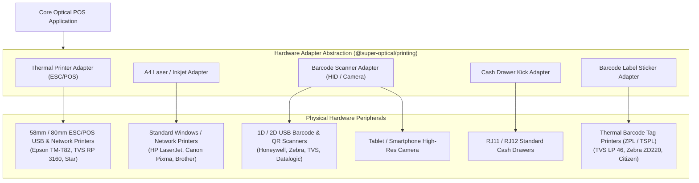

# Domain: Retail Hardware Integration & Adapters

**Document Version:** 1.0.0  
**Phase:** Phase 1 — Product Definition & Business Requirements  
**Domain Code:** `30-HARDWARE` / `@super-optical/printing`  

---

## 1. Domain Scope: Hardware Abstraction Layer

The **Retail Hardware Integration** domain connects Super Optical V2 with physical peripherals found on optical counters: thermal receipt printers, A4 laser invoice printers, barcode scanners, digital cameras, Bluetooth portable devices, and cash drawers.

> [!IMPORTANT]
> **Hardware Isolation Principle**  
> Hardware driver code is strictly decoupled from business logic. POS cart operations emit abstract print and scan events; platform adapters translate these commands into OS-specific driver instructions.

---

## 2. Supported Peripherals & Integration Profiles

---

## 3. Hardware Operational Requirements

### 3.1 Direct Silent Thermal Printing (ESC/POS)
- Windows desktop client (via Tauri native Rust binding to `winspool.drv`) sends raw ESC/POS command buffers directly to USB/network thermal receipt printers without triggering the OS print preview dialog.
- Supports 58mm (32 columns) and 80mm (48 columns) paper widths.
- Supports graphic barcode rendering and bilingual receipt headers.

### 3.2 Barcode Scanners (USB HID & Bluetooth)
- Standard USB barcode scanners act as keyboard wedge devices (emitting keystrokes followed by `Enter`).
- The application implements a global input hook that detects rapid barcode streams ($< 50\text{ms}$ inter-key latency) and intercepts them directly into POS product lookup, regardless of which input field currently has focus.

### 3.3 Camera Barcode Scanning (Mobile & Tablet)
- On Android and iOS devices running Capacitor, staff can tap the scan icon to activate the rear camera viewfinder.
- Uses native edge machine-vision algorithms to decode Code 128, EAN-13, and QR codes instantly.

### 3.4 Cash Drawer Triggering
- Sends the standard ESC/POS drawer kick pulse (`ESC p m t1 t2` or `0x1B 0x70 0x00 0x19 0xFA`) via the thermal printer's RJ-11 drawer port upon cash payment confirmation or manager drawer-open request.

### 3.5 Frame Barcode Tag Printing
- Prints dual-sided butterfly or dumbbell barcode jewelry labels designed specifically for optical spectacle temples.
- Displays Store Name, Model, Color, Eye Size, MRP, and Barcode.
