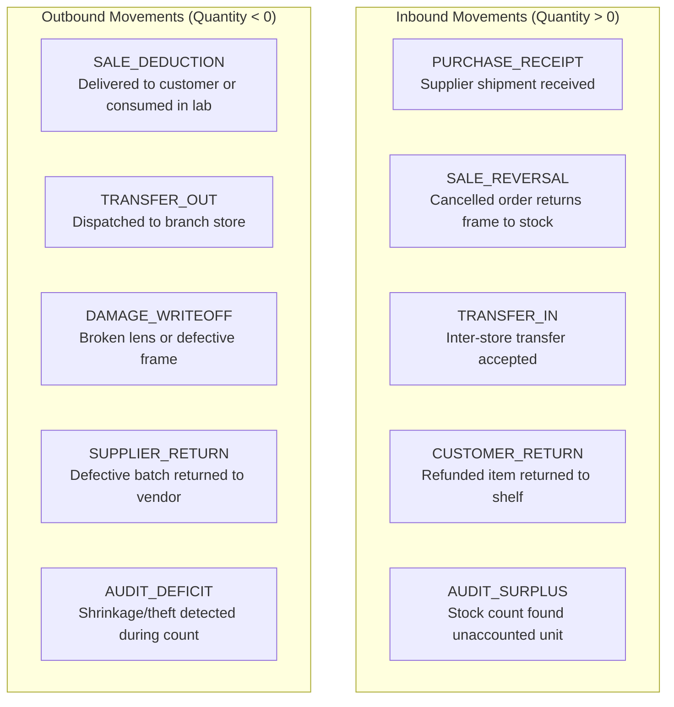

# Domain: Inventory Management & Movement Ledgers

**Document Version:** 1.0.0  
**Phase:** Phase 1 — Product Definition & Business Requirements  
**Domain Code:** `13-INVENTORY`  

---

## 1. Core Principles: Append-Only Ledger Driven

> [!IMPORTANT]
> **Fundamental Inventory Law: No Silent Mutation**  
> Direct, silent updates to stock quantities are strictly prohibited.  
> Physical inventory on hand is governed by an append-only `inventory_movements` ledger.  
> Every single stock addition, deduction, reservation, or correction MUST create an immutable movement record with an explicit business reason, user attribution, and timestamp.

---

## 2. Stock Quantities & Availability Definitions

For every `(tenant_id, store_id, product_variant_id)`, the inventory engine tracks four distinct states:

| Metric | Definition | Mathematical Invariant |
|:---|:---|:---|
| **Quantity on Hand (QOH)** | Total physical units physically located inside the store premises. | $\text{QOH} = \text{Available} + \text{Reserved}$ |
| **Reserved Quantity** | Units committed to confirmed customer sales orders awaiting lab edging or pickup. | $\ge 0$ (Cannot sell reserved units to walk-in shoppers) |
| **Available Quantity** | Units physically present and unreserved, available for immediate sale. | $\text{Available} = \text{QOH} - \text{Reserved}$ |
| **In-Transit Quantity** | Units dispatched from another store/warehouse, currently en route. | Tracked via transfer manifests |
| **Damaged / Defective** | Units quarantined due to breakage, scratches, or manufacturing defects. | Excluded from QOH; tracked in damage sub-ledger |

---

## 3. Inventory Movement Taxonomy

Every row in `inventory_movements` requires a recognized `movement_type`:



---

## 4. Key Inventory Workflows

### 4.1 Sales Order Stock Reservation & Final Deduction
1. **Order Confirmation:** Customer purchases a frame. System creates an inventory reservation:
   - `quantity_reserved` increments by 1.
   - `available_quantity` decrements by 1.
   - Physical `quantity_on_hand` remains unchanged.
2. **Order Cancellation:** If order is cancelled before lab processing:
   - `quantity_reserved` decrements by 1.
   - `available_quantity` increments by 1.
3. **Order Handover / Delivery:** When customer collects spectacles:
   - `quantity_reserved` decrements by 1.
   - `quantity_on_hand` decrements by 1.
   - System commits `SALE_DEDUCTION` movement in ledger.

### 4.2 Inter-Store Stock Transfers (Two-Phase Commit)
```mermaid
sequenceDiagram
    autonumber
    participant StoreA as Store A (Dispatching)
    participant Ledger as Inventory Movement Ledger
    participant StoreB as Store B (Receiving)

    StoreA->>Ledger: Dispatch Transfer (quantity: -2, Type: TRANSFER_OUT)
    Note over StoreA: Store A QOH decrements immediately.<br/>Transfer marked IN_TRANSIT.
    Note over StoreB: Physical shipment travels between stores.
    StoreB->>StoreB: Shipment arrives; staff scans barcodes
    StoreB->>Ledger: Acknowledge Receipt (quantity: +2, Type: TRANSFER_IN)
    Note over StoreB: Store B QOH increments.<br/>Transfer marked COMPLETED.
```

### 4.3 Physical Stock Counting & Variance Reconciliation
- Stores conduct periodic cycle counts (e.g. monthly frame inventory audit).
- Staff scans all frames in display cases and drawers using barcode scanners.
- System compares scanned count against expected `quantity_on_hand`.
- Any discrepancy requires a formal `stock_adjustment` record with manager sign-off:
  - Discrepancy positive: logs `AUDIT_SURPLUS`.
  - Discrepancy negative: logs `AUDIT_DEFICIT` with reason code (e.g., `SHRINKAGE`, `THEFT`, `UNRECORDED_SAMPLE`).
