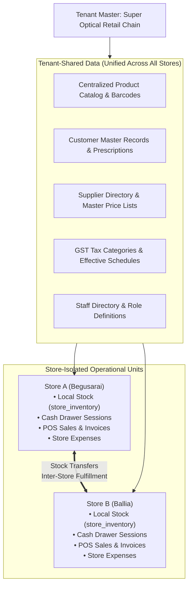

# Domain: Multi-Store Chain Operations

**Document Version:** 1.0.0  
**Phase:** Phase 1 — Product Definition & Business Requirements  
**Domain Code:** `05-STORES` / `29-MULTI-STORE`  

---

## 1. Multi-Store Architecture: Shared vs Isolated Data

In a multi-store optical retail chain (e.g. Main Branch in Begusarai, Branch 2 in Ballia), data is partitioned into **Tenant-Shared** assets and **Store-Isolated** operations:

---

## 2. Shared vs Store-Specific Data Matrix

| Domain Asset | Scoping Level | Operational Rules |
|:---|:---|:---|
| **Product Master** | Tenant-Shared | Created once at headquarters; immediately visible across all stores. |
| **Store Inventory** | Store-Isolated | Physically tracked per store. Begusarai holding 4 units $\neq$ Ballia holding 2 units. |
| **Customer Profiles** | Tenant-Shared | A customer registered at Store A can walk into Store B; their eye test history, prescriptions, and credit balance are immediately accessible. |
| **Sales & Invoices** | Store-Isolated | Invoice numbers are sequential per store (e.g. `BEG/...` vs `BAL/...`). Tax liability attributes to the selling store's state GSTIN. |
| **Cash Registers** | Store-Isolated | Cash drawer sessions are bound to specific physical terminals inside each store. |
| **Optical Workshop** | Configurable | A store can operate an in-house workshop or dispatch jobs to a centralized hub lab. |
| **Staff Users** | Store-Scoped | Staff members are assigned to specific home stores. Roaming staff (e.g. Area Manager) can be granted multi-store access. |

---

## 3. Inter-Store Stock Transfers

When Store A is out of stock of a designer frame requested by a customer:
1. **Stock Lookup:** Staff queries POS; system shows Store B has 2 units available.
2. **Transfer Request:** Store A raises an internal stock transfer request.
3. **Dispatch (Store B):** Store B approves and packs the frame. System logs an outbound `TRANSFER_OUT` movement. Stock status $\rightarrow$ `IN_TRANSIT`.
4. **Receipt (Store A):** Frame arrives at Store A via courier or staff shuttle. Store A scans barcode to acknowledge receipt. System logs `TRANSFER_IN` movement. Stock status $\rightarrow$ `AVAILABLE` at Store A.
5. **Traceability:** Complete transit history is logged with dispatching user, receiving user, and timestamps.
