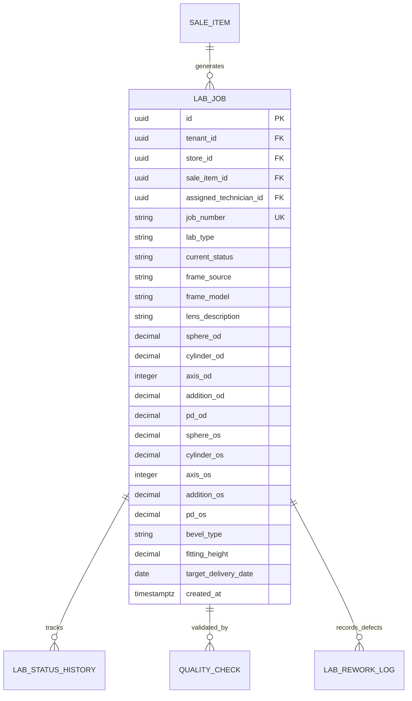

# Domain: Optical Laboratory & Workshop Workflow

**Document Version:** 1.0.0  
**Phase:** Phase 1 — Product Definition & Business Requirements  
**Domain Code:** `22-OPTICAL-LAB`  

---

## 1. Domain Scope & Optical Production Workflow

The **Optical Laboratory & Workshop** domain governs the manufacturing, lens edging, frame mounting, and quality verification of custom prescription eyewear. It bridges the commercial sales order with physical lens edging machinery and technical opticians.

```mermaid
graph TD
    Sale[1. Confirmed Order / Sale Created] --> LabJob[2. Lab Job Created & Queued]
    LabJob --> LensProc[3. Lens Procurement / Surfacing<br/>(Stock blank pulled or ordered from Essilor/Zeiss)]
    LensProc --> Edging[4. Lens Edging & Beveling<br/>(Patternless CNC Edger)]
    Edging --> Fitting[5. Frame Mounting & Assembly<br/>(Nylon grooving, screw insertion, alignment)]
    Fitting --> QC[6. Quality Control Inspection<br/>(Focimeter power & cosmetic check)]
    QC -->|Pass| Ready[7. READY_FOR_DELIVERY<br/>(Customer notified)]
    QC -->|Fail| Rework[8. REWORK / REMAKE<br/>(Reorder lens blank & log defect)]
    Rework --> LensProc
```

---

## 2. Lab Job Data Model & Parameters

Every prescription spectacle order generates an individual `lab_jobs` record linking frame, lenses, and clinical specifications:



### Technical Edging Instructions:
- **Frame Source:** Store Stock Frame vs Customer's Own Frame (requiring extra handling caution).
- **Bevel Type:** Standard V-Bevel (full-rim acetate/metal), Mini-Bevel (thin metal), Flat Bevel (semi-rimless supra nylon cord), Polish Rimless (three-piece drill mount).
- **Fitting Height & Segment Height:** Crucial millimeter measurements for progressive and bifocal lens alignment.

---

## 3. Lab Job State Machine (Proposed Statuses)

> [!NOTE]
> **Status Lifecycle Classification: PROPOSED**  
> The following operational states are proposed for production and will be confirmed during Phase 9:

| Status Code | Description | Next Permitted Transitions |
|:---|:---|:---|
| `JOB_CREATED` | Sale confirmed; job ticket generated and queued. | `LENS_ORDERED`, `IN_SURFACING`, `READY_FOR_EDGING` |
| `LENS_ORDERED` | Lens blanks ordered from external laboratory (e.g. Rx progressive). | `LENS_RECEIVED`, `CANCELLED` |
| `LENS_RECEIVED` | Uncut lens blanks arrived and power verified on focimeter. | `READY_FOR_EDGING` |
| `IN_EDGING` | Technician has mounted blanks on edging machine. | `IN_FITTING`, `REMAKE_REQUIRED` |
| `IN_FITTING` | Edged lenses being fitted into frame and aligned. | `IN_QC`, `REMAKE_REQUIRED` |
| `IN_QC` | Undergoing final inspection on focimeter and visual alignment. | `READY_FOR_PICKUP`, `QC_FAILED` |
| `QC_FAILED` | Failed power, axis, or cosmetic inspection. | `REMAKE_REQUIRED` |
| `REMAKE_REQUIRED`| Lens broken, scratched, or out-of-tolerance. New blanks requested. | `LENS_ORDERED`, `READY_FOR_EDGING` |
| `READY_FOR_PICKUP`| Passed all checks; packaged and ready in retail store. | `DELIVERED` |
| `DELIVERED` | Customer tried on and collected finished spectacles. | `CLOSED` |

---

## 4. Digital Quality Control (QC) Checklist

Before a lab job can be marked `READY_FOR_PICKUP`, the technician must complete an immutable digital QC checklist:
1. **Right Lens (OD) Power Check:** Measured SPH, CYL, Axis within ISO 21987 tolerances.
2. **Left Lens (OS) Power Check:** Measured SPH, CYL, Axis within ISO 21987 tolerances.
3. **Pupillary Distance (PD):** Total measured distance matches prescription within $\pm 0.5\text{ mm}$.
4. **Prism & Alignment:** Optical centers aligned; no unwanted induced prism.
5. **Cosmetic & Mechanical Inspection:** 
   - Lenses fit snugly without frame warping or gaps.
   - Zero coating scratches, crazing, or edge chips.
   - Temple screws tightened; frame sits flat on four-point touch surface.
6. **Technician Signature:** Digital user attribution logged with timestamp.
