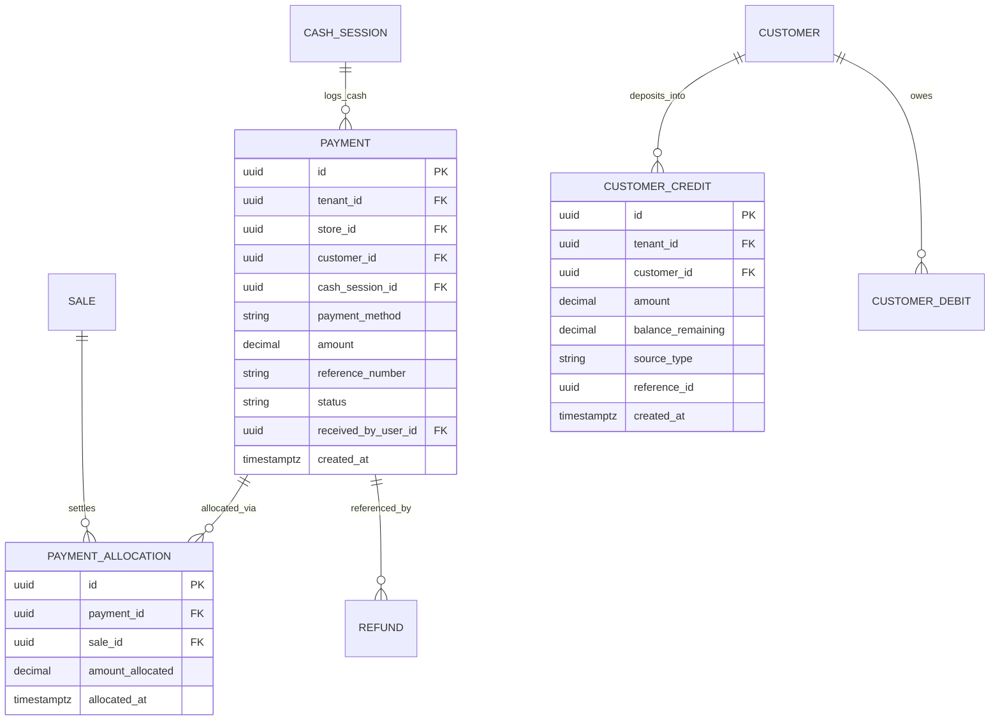

# Domain: Payments & Financial Transactions

**Document Version:** 1.0.0  
**Phase:** Phase 1 — Product Definition & Business Requirements  
**Domain Code:** `18-PAYMENTS` / `20-CREDIT-DEBIT`  

---

## 1. Core Principles: Transactional Financial Accounting

> [!IMPORTANT]
> **Payments are Immutable Ledger Events**  
> An invoice row DOES NOT maintain a simple mutable `paid_amount` column as the authoritative financial truth.  
> Every monetary inflow or outflow is recorded as an immutable `payments` or `refunds` transaction row, linked to sales via explicit `payment_allocations`.  
> An invoice's balance is deterministically computed as:  
> $$\text{Invoice Balance Due} = \text{Invoice Total} - \sum(\text{Allocated Payments}) + \sum(\text{Allocated Refunds})$$

---

## 2. Payment Methods & Tenders Supported

Super Optical V2 supports 6 standard payment tenders:

| Tender Code | Payment Method | Tracking & Verification Attributes |
|:---|:---|:---|
| `CASH` | Physical Currency | Linked directly to the active counter `cash_session_id` for drawer balancing. |
| `UPI` | Unified Payments Interface (India) | Dynamic/Static QR code, Bank UTR reference number (12 digits), payment provider. |
| `CARD` | Credit / Debit Card Terminal | EDC machine transaction reference, last 4 digits of card, card network (Visa/Master/RuPay). |
| `BANK_TRANSFER` | NEFT / RTGS / IMPS | Bank transaction reference number, transfer date, payer bank account name. |
| `CUSTOMER_CREDIT`| Store Credit / Advance Ledger | Deducted directly from customer's available credit balance (`customer_credits`). |
| `GATEWAY` | Online Payment Link | Razorpay / Stripe / PhonePe webhook confirmation ID. |

---

## 3. Financial Transaction Entity Architecture

---

## 4. Key Financial Workflows

### 4.1 Advance Deposit & Balance Settlement
1. **Order Intake:** Spectacles ordered for ₹6,000. Customer pays ₹2,000 via UPI.
   - `payments` record created: ₹2,000, tender `UPI`.
   - `payment_allocations` links ₹2,000 to Sale #101.
   - Sale status $\rightarrow$ `PARTIALLY_PAID`, balance due = ₹4,000.
2. **Pickup & Settlement:** Customer returns to collect finished spectacles. Pays ₹4,000 Cash.
   - `payments` record created: ₹4,000, tender `CASH`, linked to active cashier session.
   - `payment_allocations` links ₹4,000 to Sale #101.
   - Sale status $\rightarrow$ `PAID`, balance due = ₹0.

### 4.2 Handling Excess Payments (Invoice Downward Revision)
- Customer paid ₹4,000 advance on an order originally totaling ₹5,000.
- Customer downgrades frame; revised invoice total is ₹3,200.
- Total payments received (₹4,000) exceed new order total by ₹800.
- **Automated Credit Engine:**
  1. Allocation to Sale is capped at ₹3,200.
  2. Surplus ₹800 is automatically credited to `customer_credits` (`source_type: 'OVERPAYMENT_REVISION'`).
  3. The customer can use this ₹800 credit balance immediately to buy sunglasses or accessories, or request a cash refund voucher.

### 4.3 Refunds & Reversals
- Payments are never updated or deleted in place.
- If a cashier enters an incorrect payment tender or an order is cancelled:
  1. A formal `refunds` transaction is logged with explicit supervisor authorization.
  2. If the original tender was `CASH`, the refund deducts from the active cash drawer session.
  3. The original payment allocation is deactivated or offset by a negative refund allocation.
