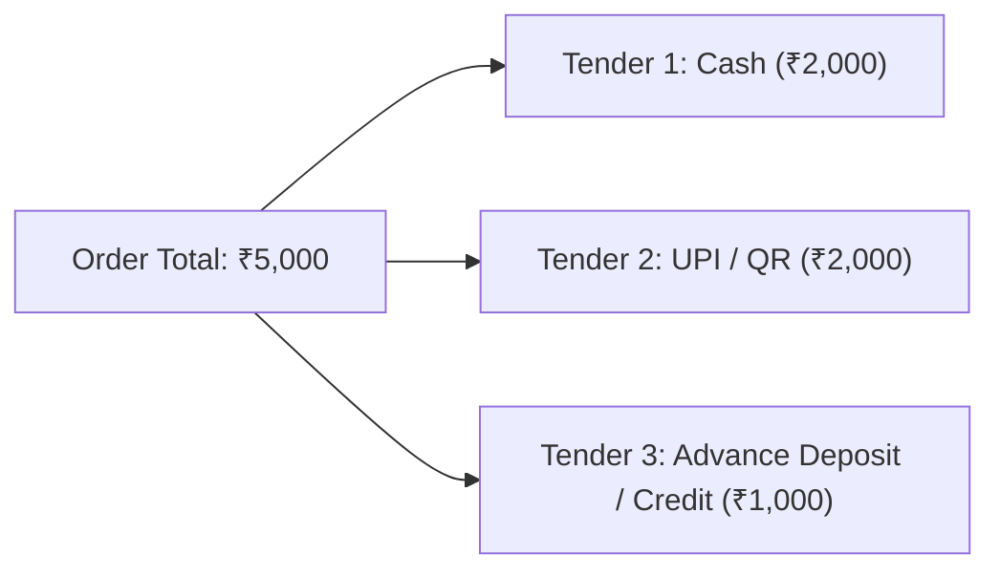

# Domain: Point of Sale (POS) Engine

**Document Version:** 1.0.0  
**Phase:** Phase 1 — Product Definition & Business Requirements  
**Domain Code:** `16-POS`  

---

## 1. Domain Scope: Dedicated Optical POS

The **Point of Sale (POS)** engine is one of the primary operational interfaces in Super Optical V2. It is engineered specifically for optical retail workflows, enabling rapid checkout counters, frame barcode scanning, lens bundle assembly, optical prescription linking, and multi-tender split payments.

---

## 2. Optical-Specific Cart Architecture

Unlike a generic retail grocery cart containing isolated SKUs, the optical POS cart supports **Linked Optical Bundles**:

```mermaid
graph TD
    Cart[POS Cart Session]
    Item1[Item 1: Sunglasses SKU<br/>Standalone Ready-to-Wear]
    Item2[Item 2: Optical Bundle<br/>Complex Custom Spectacles]
    Item3[Item 3: Lens Cleaning Spray<br/>Accessory SKU]

    Cart --> Item1
    Cart --> Item2
    Cart --> Item3

    subgraph OpticalBundle["Item 2: Optical Bundle Structure"]
        Frame[Frame Component:<br/>Ray-Ban RB3025 (Inventory Deducted)]
        LensOD[Right Lens (OD):<br/>Essilor Crizal 1.60 SV (Custom Rx)]
        LensOS[Left Lens (OS):<br/>Essilor Crizal 1.60 SV (Custom Rx)]
        FittingFee[Workshop Fitting / Edging Fee]
        RxLink[Linked Prescription ID: RX-2026-0892]
    end

    Item2 --> Frame
    Item2 --> LensOD
    Item2 --> LensOS
    Item2 --> FittingFee
    Item2 --> RxLink
```

---

## 3. Core POS Capabilities

### 3.1 High-Speed Product Lookup & Barcode Scanning
- Instant search by frame model name, brand, color, or direct barcode scanner input (Code 128 / EAN-13).
- Visual stock indicators display current available inventory in the active store and sibling branches.

### 3.2 Optical Prescription Attachment
- Staff can attach an existing customer prescription with one click.
- Option to perform on-the-spot prescription entry if customer brings an external doctor's paper slip.
- The cart validates that prescription diopter ranges match the selected lens index capabilities (e.g. warning staff if $-7.00\text{ D}$ is configured with thick $1.50$ index lenses).

### 3.3 Hold & Resume Cart
- A sales associate assisting a customer who steps aside to deliberate can park the active cart session (`HOLD`).
- The counter can immediately serve another customer and later resume the held cart without losing configured frame and lens options.

### 3.4 Quotation to Sale Conversion
- Generates printed or WhatsApp estimates with a 15-day price guarantee.
- When the customer returns to purchase, the cashier opens the Quotation and converts it to a confirmed sales order with a single click.

---

## 4. Payment Tenders & Settlement Modes

The POS checkout supports flexible, multi-tender transactions committed atomically:



1. **Full Immediate Settlement:** Complete payment collected upon ordering (common for ready-to-wear sunglasses and accessories).
2. **Advance Payment (Deposit):** Customer pays a partial deposit (e.g. $50\%$ advance) for custom-edged spectacles. The order enters `PARTIALLY_PAID` status. The balance is collected upon pickup.
3. **Credit Sale (On Account):** Trusted corporate accounts or regular customers can purchase on credit; balance adds to customer's outstanding account ledger.
4. **Split Payments:** Arbitrary combinations of Cash, UPI, Card, and Store Credit in a single checkout.

---

## 5. Receipt & Fiscal Tax Invoice Generation

Upon order completion, the POS engine dispatches formatting to the hardware adapter:
- **Thermal Slip (58mm / 80mm ESC/POS):** Compact receipt including store details, customer name, frame/lens summary, prescription summary, advance paid, remaining balance due, and barcode order pickup tracker.
- **A4 Tax Invoice:** Full statutory tax invoice with legal GSTIN, HSN summary table, CGST/SGST breakdown, and customer signature block.
