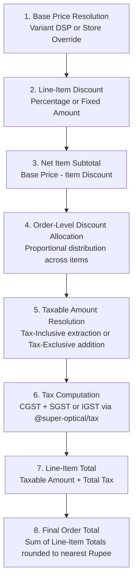

# Domain: Pricing & Discount Engine

**Document Version:** 1.0.0  
**Phase:** Phase 1 — Product Definition & Business Requirements  
**Domain Code:** `11-PRICING`  

---

## 1. Pricing Engine Principles

1. **Deterministic Calculations**: Currency calculations must execute with exact arithmetic precision using 64-bit integer cents/paise or `NUMERIC(14, 2)`. Floating-point math is strictly forbidden.
2. **Layered Pricing Resolution**: The price of an item is resolved sequentially:  
   $$\text{MSRP / MRP} \longrightarrow \text{Default Selling Price} \longrightarrow \text{Store Override} \longrightarrow \text{Promotional Price} \longrightarrow \text{Discounts}$$
3. **No Hard-Coded Tax Coupling**: Tax calculations are resolved dynamically via `@super-optical/tax` according to date-effective rates. Prices can be configured as **Tax-Inclusive** or **Tax-Exclusive**.

---

## 2. Price Types Defined

| Price Type | Description | Visibility / Usage |
|:---|:---|:---|
| **MRP (Maximum Retail Price)** | Government-regulated statutory price printed on product packaging in India. | Printed on barcode price tags; selling price can never legally exceed MRP. |
| **Default Selling Price (DSP)** | Standard selling price set by tenant across normal operations. | Default checkout price unless an active promotion or store override applies. |
| **Store Selling Price (Override)** | Store-specific price override (e.g. flagship mall store vs suburban branch). | Overrides Default Selling Price for that store location. |
| **Minimum Selling Price (MSP)** | Floor price below which discounts cannot drop without manager approval. | Safeguard against cashier margin erosion. |
| **Standard Cost / Purchase Price**| Weighted average purchase price or latest supplier invoice cost. | Restricted to Owner/Manager; used to calculate real-time gross profit margin. |

---

## 3. Discount Structures

Super Optical V2 supports three levels of discounts:

### 3.1 Line-Item Discounts
- Applied directly to an individual frame, lens, or accessory in the cart.
- Modes:
  - **Percentage Discount:** e.g., $15\%$ off frame MSRP.
  - **Fixed Amount Discount:** e.g., flat $₹500$ off.
- Enforced constraint: Discounted price cannot breach the item's Minimum Selling Price (MSP) without supervisor authorization.

### 3.2 Order-Level (Cart) Discounts
- Applied to the total order subtotal after item-level calculations.
- Modes:
  - **Lump-Sum Cart Discount:** e.g., $₹1,000$ courtesy discount on total bill.
  - **Promotional Coupon Code:** e.g., `FESTIVE2026` ($10\%$ off cart, max $₹1,500$).
- Proportional Allocation: For tax calculation and accounting return purposes, order-level discounts are distributed proportionally across cart items based on their taxable value.

### 3.3 Optical Package Bundling
- Optical stores frequently sell bundled packages (e.g. *"Complete Spectacles at ₹1,999"* including Frame up to ₹1,200 + Standard Single Vision Antiglare Lenses).
- When bundled:
  - POS calculates bundle discount as:  
    $$\text{Bundle Discount} = (\text{Frame Price} + \text{Lens Price}) - \text{Package Fixed Price}$$
  - Discount is apportioned between the frame and lens components for compliant GST reporting.

---

## 4. Mathematical Execution Sequence

The deterministic checkout calculation pipeline executes in 8 discrete steps:

### Tax Extraction Formula (Tax-Inclusive Pricing):
$$\text{Taxable Value} = \frac{\text{Discounted Price}}{1 + \frac{\text{GST Rate}}{100}}$$
$$\text{Tax Amount} = \text{Discounted Price} - \text{Taxable Value}$$
