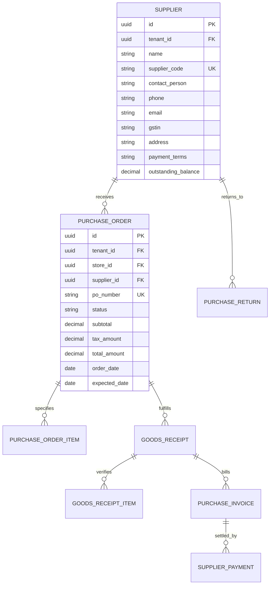

# Domain: Procurement & Supplier Management

**Document Version:** 1.0.0  
**Phase:** Phase 1 — Product Definition & Business Requirements  
**Domain Code:** `14-PROCUREMENT` / `15-SUPPLIERS`  

---

## 1. Domain Scope & Objectives

The **Procurement & Supplier Management** domain governs vendor relationships, purchase order generation for frames, contact lenses, uncut ophthalmic lens blanks, and accessories, receiving goods into store warehouses, matching vendor invoices, and tracking accounts payable.

---

## 2. Standard Procurement Lifecycle

The standard procurement pipeline executes in 5 sequential stages:

```mermaid
graph LR
    S[1. Supplier Selection] --> PO[2. Purchase Order<br/>Issued to Vendor]
    PO --> GRN[3. Goods Receipt Note (GRN)<br/>Physical Intake & Barcoding]
    GRN --> INV[4. Inventory Movement<br/>PURCHASE_RECEIPT logged]
    GRN --> PI[5. Purchase Invoice<br/>Vendor Bill Registered]
    PI --> PAY[6. Supplier Payment<br/>Accounts Payable Settled]
```

### Stage Breakdown:
1. **Purchase Order (PO):** Created by Inventory Manager based on low-stock alerts or customer custom prescription lens requirements. Specifies line items, quantities, agreed unit cost, tax expectations, and expected delivery date.
2. **Goods Receipt Note (GRN):** When physical shipment arrives, receiving staff scans barcode labels and checks for transit damage. Supports partial receipts (e.g. 80 out of 100 frames delivered).
3. **Inventory Movement:** Commits an immutable `PURCHASE_RECEIPT` row in the inventory ledger for received quantities. Newly received items become immediately available for retail sale.
4. **Purchase Invoice:** Vendor's tax invoice is recorded against the GRN. Three-way matching verifies:
   $$\text{PO Quantities/Prices} \longleftrightarrow \text{GRN Accepted Quantities} \longleftrightarrow \text{Vendor Invoice Totals}$$
5. **Supplier Payment:** Accounting settles the bill via Bank Transfer / Cheque, logging payables ledger adjustments.

---

## 3. Supplier Entity & Ledger Model



---

## 4. Exceptions & Return Workflows

### 4.1 Purchase Order Cancellation Rules
- A Purchase Order in `DRAFT` status can be cancelled or edited freely.
- A PO in `SUBMITTED` status can only be cancelled if zero goods have been received.
- Once a partial Goods Receipt has been generated, the remaining unfulfilled balance can be closed using the `CLOSE_SHORT` command, terminating the remaining order quantity.

### 4.2 Purchase Returns (Debit Note to Vendor)
- Defective frames (snapped hinges, peeling plating) or incorrect lens blank powers discovered during QC can be returned to the supplier.
- Initiating a Purchase Return:
  1. Creates a `PURCHASE_RETURN` record referencing the original Purchase Invoice.
  2. Commits an outbound `SUPPLIER_RETURN` row in `inventory_movements`, deducting stock from `store_inventory`.
  3. Generates a formal **Debit Note** reducing the tenant's accounts payable balance with the supplier.
