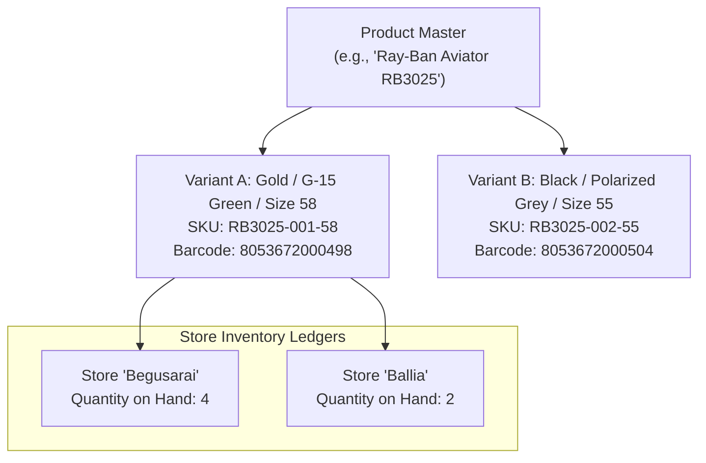
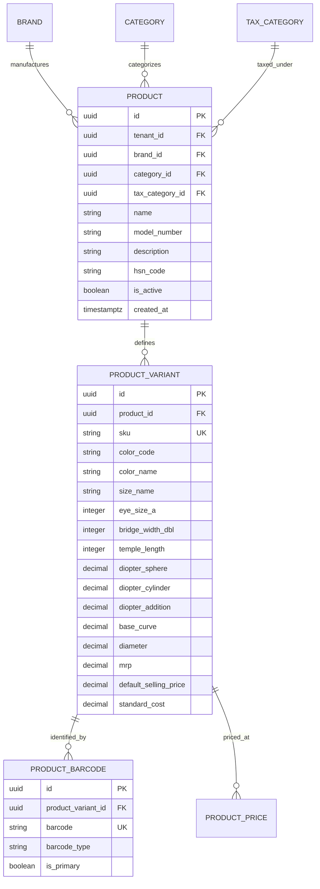

# Domain: Product Catalog & Optical Taxonomy

**Document Version:** 1.0.0  
**Phase:** Phase 1 — Product Definition & Business Requirements  
**Domain Code:** `10-PRODUCT-CATALOG`  

---

## 1. Product Architecture: Decoupling Definition from Stock

> [!CAUTION]
> **Fundamental Catalog Rule: Never Mix Definition with Inventory**  
> A `Product` defines the general model.  
> A `ProductVariant` defines the specific SKU (color, size, bridge, diopter power).  
> A `StoreInventory` record tracks how many physical units of that variant exist at a specific store location.  
> Product definitions are centralized and shared across all stores; inventory counts are localized to each store.

---

## 2. Product Categories & Optical Taxonomy

Super Optical V2 natively supports 8 optical product categories:

### 2.1 Optical Frames
- **Attributes:** Rim Type (Full-Rim, Semi-Rimless, Rimless, Supra), Shape (Aviator, Wayfarer, Round, Cat-Eye, Rectangle, Geometric), Material (Acetate, Monel, Titanium, TR90, Ultem, Stainless Steel, Carbon Fiber), Eye Size ($A$, in mm), Bridge Width ($DBL$, in mm), Temple Length (in mm), Vertical Height ($B$, in mm), Hinge Type (Spring, Barrel, Screwless).
- **Tax HSN Code:** `9003` (Frames and mountings for spectacles).

### 2.2 Ophthalmic Lenses
- **Attributes:** Vision Type (Single Vision, Bifocal - Round Top / Flat Top / D-Segment, Progressive), Lens Index ($1.50, 1.56, 1.59\text{ Polycarbonate}, 1.60, 1.67, 1.74$), Material (CR-39, Polycarbonate, Trivex, High-Index Resin, Mineral Glass), Design (Spheric, Aspheric, Atoric, Freeform Digital), Coatings (Hard Coat, Anti-Reflective / HMC, Blue Light Filter, Photochromic / Transitions, Hydrophobic, Tinted).
- **Tax HSN Code:** `9001` (Contact lenses and spectacle lenses of glass or other materials).

### 2.3 Sunglasses
- **Attributes:** Frame Shape, Lens Tint (Grey, Brown, G-15 Green, Gradient, Mirrored), Lens Technology (Polarized, Non-Polarized, UV400, Photochromic), Gender (Men, Women, Unisex, Kids).
- **Tax HSN Code:** `9004` (Spectacles, goggles and the like, corrective, protective or other).

### 2.4 Contact Lenses
- **Attributes:** Modality (Daily Disposable, Bi-Weekly, Monthly, Quarterly, Yearly), Material (Hydrogel, Silicone Hydrogel), Optical Design (Spherical, Toric / Astigmatism, Multifocal / Presbyopia, Cosmetic / Colored), Base Curve ($8.3 - 8.9\text{ mm}$), Diameter ($13.8 - 14.5\text{ mm}$), Center Thickness, Pack Size (1, 2, 6, 30, 90 lenses).
- **Tax HSN Code:** `9001`.

### 2.5 Contact Lens Solutions & Eye Care
- **Attributes:** Volume ($60\text{ ml}, 120\text{ ml}, 350\text{ ml}$), Solution Type (Multi-Purpose Disinfecting, Hydrogen Peroxide, Saline, RGP Conditioning), Lubricating Eye Drops (Over-the-Counter comfort drops).

### 2.6 Ready-to-Wear Reading Glasses
- **Attributes:** Standard diopter steps ($+1.00, +1.25, +1.50, +1.75, +2.00, +2.50, +3.00$), Frame Style, Folding mechanism.

### 2.7 Computer Glasses
- **Attributes:** Zero diopter (Plano) blue-light blocking lenses pre-fitted into ergonomic frames.

### 2.8 Optical Accessories
- **Attributes:** Microfiber cleaning cloths, anti-fog sprays, hard clamshell cases, spectacle chains/cords, silicone nose pads, ear hooks, mini screwdriver kits.

---

## 3. Product Entity Model

---

## 4. SKU & Barcode Strategy

1. **Auto-Generated SKU Format:** Clean human-readable code:  
   `[CATEGORY-PREFIX]-[BRAND-CODE]-[MODEL]-[COLOR]-[SIZE]`  
   Example: `FRM-RAY-RB3025-001-58`
2. **Barcode Compatibility:** Supports Code 128 and EAN-13 barcodes for rapid POS scanning and thermal barcode sticker printing.
3. **Multi-Barcode Support:** A product variant can have multiple barcodes (e.g. manufacturer's original EAN-13 barcode + store-printed internal label).
