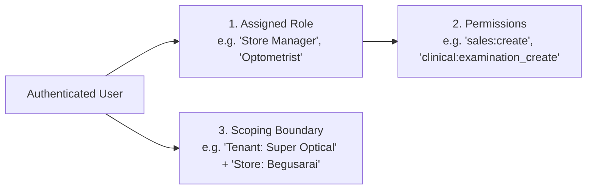

# Domain: Optical Roles, Permissions & Access Control (RBAC)

**Document Version:** 1.0.0  
**Phase:** Phase 1 — Product Definition & Business Requirements  
**Domain Code:** `04-USERS-RBAC`  

---

## 1. Security Triad: Role, Permission & Scope

Super Optical V2 decouples access control into three distinct dimensions:

1. **Permission:** An atomic, granular privilege representing a specific action on a domain resource (e.g., `sales:create`, `inventory:adjust_stock`, `prescriptions:create`).
2. **Role:** A named bundle of permissions corresponding to a business job function in an optical practice.
3. **Scope:** The operational boundary within which the user can exercise those permissions:
   - **Platform Scope:** Super-admin across all SaaS tenants.
   - **Tenant Scope:** Across all stores, warehouses, and labs owned by that optical business.
   - **Store Scope:** Strictly confined to assigned physical store location(s).

---

## 2. Granular Optical Permissions Catalog

| Domain | Permission Code | Description | Default Role Assignments |
|:---|:---|:---|:---|
| **Customer** | `customers:view` | View customer profile and contact details. | All store staff |
| | `customers:create` | Register new walk-in customer or family member. | Reception, Sales, Optometrist, Manager |
| | `customers:edit` | Update customer address or contact details. | Reception, Manager |
| | `customers:export` | Export customer phone/email lists. | Owner, Tenant Admin |
| **Clinical** | `clinical:examination_create` | Perform and record eye refraction tests. | Optometrist |
| | `clinical:examination_edit_own` | Edit own unfinalized refraction notes. | Optometrist |
| | `clinical:examination_view` | View patient clinical refraction history. | Optometrist, Dispensing Optician |
| **Prescription** | `prescriptions:create` | Issue and sign optical prescriptions. | Optometrist |
| | `prescriptions:view` | View prescription diopter values for dispensing. | Optometrist, Optician, Sales, Lab Tech |
| | `prescriptions:print_card` | Print customer digital prescription slip. | All store staff |
| **Catalog** | `catalog:view` | Search products, frames, and lens pricing. | All store staff |
| | `catalog:manage` | Create/edit brands, models, and attributes. | Inventory Manager, Owner, Admin |
| | `catalog:manage_pricing` | Update selling prices, MSP, and tax mappings. | Owner, Admin |
| **Inventory** | `inventory:view_stock` | View store available and reserved quantities. | All store staff |
| | `inventory:view_cost` | View purchase cost / standard cost. | Owner, Store Manager, Accountant |
| | `inventory:adjust_stock` | Perform stock adjustments and write-offs. | Store Manager, Inventory Manager, Owner |
| | `inventory:transfer_dispatch`| Dispatch inter-store stock transfers. | Store Manager, Inventory Manager |
| | `inventory:transfer_receive` | Acknowledge receipt of stock transfers. | Store Staff, Manager |
| **Procurement** | `procurement:create_po` | Draft purchase orders to suppliers. | Inventory Manager, Store Manager |
| | `procurement:receive_goods` | Scan and accept goods receipt notes (GRN). | Inventory Manager, Store Staff |
| **POS & Sales** | `sales:create` | Build carts, scan items, and place orders. | Sales Staff, Cashier, Manager |
| | `sales:approve_discount` | Apply discounts exceeding standard staff limit. | Store Manager, Owner |
| | `sales:revise_invoice` | Create revision on confirmed order. | Store Manager, Owner |
| | `sales:cancel_order` | Cancel confirmed sales order. | Store Manager, Owner |
| **Payments** | `payments:create` | Record cash, UPI, or card payment collections. | Cashier, Store Manager, Owner |
| | `payments:issue_refund` | Disburse cash or electronic refunds. | Store Manager, Owner |
| **Cash Register**| `cash:open_session` | Open daily register with float. | Cashier, Store Manager |
| | `cash:close_session` | Count drawer cash and submit day closing. | Cashier, Store Manager |
| | `cash:approve_variance` | Authorize drawer cash shortages or overages. | Store Manager, Owner |
| **Optical Lab** | `lab:view_jobs` | View active edging and assembly queue. | Lab Tech, Optician, Manager |
| | `lab:update_status` | Update job progress (Edging, Fitting). | Lab Tech |
| | `lab:qc_signoff` | Complete and sign digital QC checklist. | Lab Tech, Dispensing Optician |
| **Reports** | `reports:view_sales` | View daily and store sales reports. | Store Manager, Owner, Accountant |
| | `reports:view_financial` | View P&L, GST tax summaries, and margins. | Owner, Accountant, Tenant Admin |
| **Admin** | `users:manage` | Create, invite, and assign staff roles. | Owner, Tenant Admin |
| | `stores:manage` | Configure store branches and operating hours. | Owner, Tenant Admin |
| | `audit:view` | Inspect system audit trail logs. | Owner, Tenant Admin |
