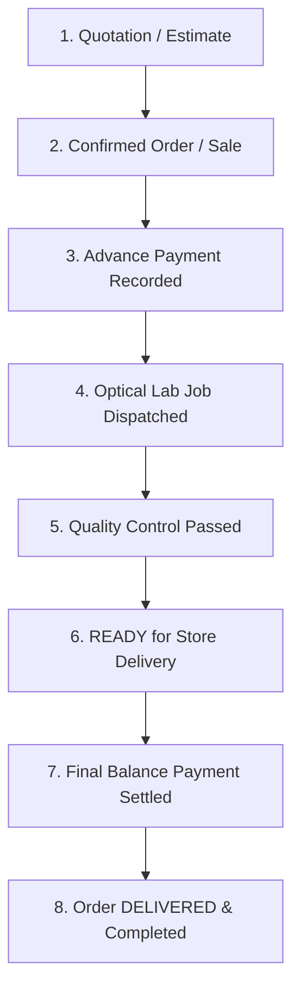

# Domain: Sales Order & Invoice Lifecycle Management

**Document Version:** 1.0.0  
**Phase:** Phase 1 — Product Definition & Business Requirements  
**Domain Code:** `17-SALES` / `21-INVOICE-LIFECYCLE`  

---

## 1. End-to-End Sales Lifecycle

---

## 2. Invoice Revision Engine: Non-Destructive Editing

> [!IMPORTANT]
> **Controlled Invoice Revisions Over In-Place Mutation**  
> Optical orders frequently require alterations after initial confirmation (e.g., customer upgrades lens coating, switches frame color, or changes prescription after consulting their doctor).  
> In-place updates that silently overwrite invoice totals are **strictly forbidden**.  
> Every modification after confirmation creates a new versioned `sale_revisions` record.

### 2.1 Revision Workflow & Impact Resolution
When an invoice is revised:
1. **Lock Current State:** The active revision snapshot is frozen.
2. **Calculate Line-Item Deltas:**
   - If frame is swapped: Old frame is returned to available inventory (`SALE_REVERSAL`); new frame is reserved/deducted (`SALE_DEDUCTION`).
   - If price increases: Difference is added to the customer's balance due.
   - If price decreases below payments already collected: The excess is automatically deposited into `customer_credits` or queued for a refund voucher.
3. **Commit Audit Record:** Stores revision number, user ID, reason code, and financial impact.

---

## 3. Order Status State Machine

| Status | Description | Permitted Next Transitions |
|:---|:---|:---|
| `DRAFT` | Temporary unconfirmed cart. | `CONFIRMED`, `CANCELLED` |
| `CONFIRMED` | Customer committed to purchase; inventory reserved. | `PARTIALLY_PAID`, `PAID`, `PROCESSING`, `CANCELLED` |
| `PARTIALLY_PAID` | Advance deposit received; balance pending. | `PAID`, `PROCESSING`, `CANCELLED` |
| `PAID` | 100% of order total settled. | `PROCESSING`, `READY`, `REFUND_PENDING` |
| `PROCESSING` | In optical workshop or awaiting lens delivery from supplier. | `READY`, `ON_HOLD`, `CANCELLED` |
| `READY` | Lenses edged, fitted, inspected; awaiting customer pickup. | `DELIVERED`, `RETURN_REQUESTED` |
| `DELIVERED` | Handed over to customer; final receipt issued. | `COMPLETED`, `RETURN_REQUESTED` |
| `CANCELLED` | Order terminated prior to delivery. | (Terminal State) |
| `RETURNED` | Delivered spectacles returned for refund or credit note. | (Terminal State) |

---

## 4. Invoicing, Credit Notes & Debit Notes

### 4.1 Statutory Invoice Numbering
- Invoices follow sequential, tamper-proof numbering scoped per store and financial year:  
  `[STORE-CODE]/[FY]/[SEQUENCE-NUMBER]`  
  Example: `BEG/2026-27/00482`
- Sequence gaps are audited and tracked to comply with tax authority guidelines.

### 4.2 Credit Notes (Sales Returns)
- If a delivered pair of glasses is returned due to customer dissatisfaction or frame defect:
  1. A formal **Credit Note** is generated referencing the original tax invoice.
  2. Inventory is updated if the frame is restocked.
  3. The credit note value is credited to the customer's account (`customer_credits`) or disbursed via formal refund transaction.

### 4.3 Debit Notes (Price Adjustments)
- If an invoice was undercharged due to missing addon lens charges, a **Debit Note** is issued to document the supplementary tax liability without mutating the original closed invoice.
