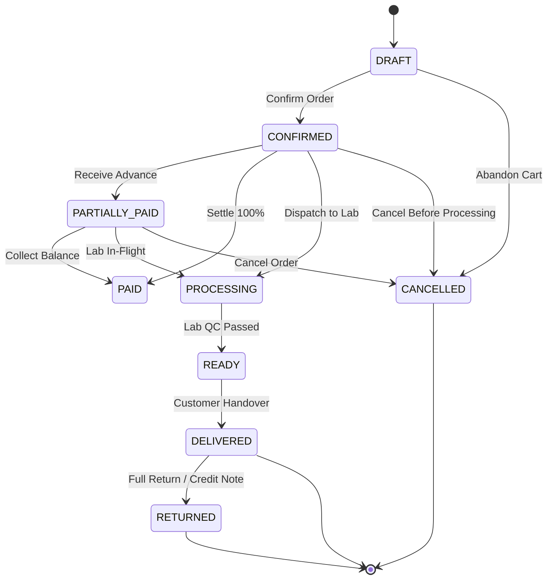

# Domain: State Machine Specifications & Transition Matrices

**Document Version:** 1.0.0  
**Phase:** Phase 1 — Product Definition & Business Requirements  
**Classification:** Canonical Operational State Machines  

---

## 1. Overview

To guarantee deterministic business execution, eliminate invalid lifecycle transitions, and preserve audit integrity, Super Optical V2 defines 11 formal finite state machines (FSMs).

---

## 2. The 11 Core State Machines

### 2.1 Sale / Order State Machine
- **States:** `DRAFT`, `CONFIRMED`, `PARTIALLY_PAID`, `PAID`, `PROCESSING`, `READY`, `DELIVERED`, `CANCELLED`, `RETURNED`.

- **Valid Transitions:**
  - `DRAFT` $\rightarrow$ `CONFIRMED`, `CANCELLED`
  - `CONFIRMED` $\rightarrow$ `PARTIALLY_PAID`, `PAID`, `PROCESSING`, `CANCELLED`
  - `PARTIALLY_PAID` $\rightarrow$ `PAID`, `PROCESSING`, `CANCELLED`
  - `PROCESSING` $\rightarrow$ `READY`, `CANCELLED`
  - `READY` $\rightarrow$ `DELIVERED`
  - `DELIVERED` $\rightarrow$ `RETURNED`
- **Invalid Transitions (Rejected by Guard):**
  - `DELIVERED` $\rightarrow$ `DRAFT` (Illegal regression)
  - `CANCELLED` $\rightarrow$ `PAID` (Cannot collect payments on cancelled orders)
  - `DRAFT` $\rightarrow$ `DELIVERED` (Must pass through confirmation and lab)

---

### 2.2 Invoice Lifecycle State Machine
- **States:** `DRAFT_INVOICE`, `ISSUED`, `REVISED`, `CANCELLED`, `CREDIT_NOTE_ISSUED`.
- **Transitions:**
  - `DRAFT_INVOICE` $\rightarrow$ `ISSUED`
  - `ISSUED` $\rightarrow$ `REVISED` (creates new revision, keeps previous immutable)
  - `ISSUED` $\rightarrow$ `CANCELLED` (pre-delivery cancellation)
  - `ISSUED` $\rightarrow$ `CREDIT_NOTE_ISSUED` (post-delivery return)

---

### 2.3 Payment State Machine
- **States:** `INITIATED`, `PENDING_VERIFICATION`, `COMPLETED`, `FAILED`, `REVERSED`.
- **Transitions:**
  - `INITIATED` $\rightarrow$ `COMPLETED` (Cash or instant card swipe)
  - `INITIATED` $\rightarrow$ `PENDING_VERIFICATION` (Awaiting UPI webhook / bank UTR)
  - `PENDING_VERIFICATION` $\rightarrow$ `COMPLETED`
  - `PENDING_VERIFICATION` $\rightarrow$ `FAILED`
  - `COMPLETED` $\rightarrow$ `REVERSED` (Authorized financial correction)

---

### 2.4 Refund State Machine
- **States:** `REQUESTED`, `APPROVED`, `DISBURSED`, `REJECTED`.
- **Transitions:**
  - `REQUESTED` $\rightarrow$ `APPROVED` (Manager authorizes)
  - `REQUESTED` $\rightarrow$ `REJECTED` (Manager denies policy breach)
  - `APPROVED` $\rightarrow$ `DISBURSED` (Cash paid out or gateway reversal executed)

---

### 2.5 Inventory Movement State Machine
- **States:** `PENDING_DISPATCH`, `IN_TRANSIT`, `COMMITTED`, `REVERTED`.
- **Transitions:**
  - Standard movement: Enters `COMMITTED` immediately upon ledger insertion.
  - Inter-store transfer: `PENDING_DISPATCH` $\rightarrow$ `IN_TRANSIT` $\rightarrow$ `COMMITTED` (at receiving store).

---

### 2.6 Purchase Order (PO) State Machine
- **States:** `DRAFT`, `SUBMITTED`, `PARTIALLY_RECEIVED`, `FULLY_RECEIVED`, `CANCELLED`, `CLOSED_SHORT`.
- **Transitions:**
  - `DRAFT` $\rightarrow$ `SUBMITTED`, `CANCELLED`
  - `SUBMITTED` $\rightarrow$ `PARTIALLY_RECEIVED`, `FULLY_RECEIVED`, `CANCELLED`
  - `PARTIALLY_RECEIVED` $\rightarrow$ `FULLY_RECEIVED`, `CLOSED_SHORT`

---

### 2.7 Goods Receipt (GRN) State Machine
- **States:** `DRAFT_INSPECTION`, `ACCEPTED`, `REJECTED`, `RETURNED_TO_VENDOR`.
- **Transitions:**
  - `DRAFT_INSPECTION` $\rightarrow$ `ACCEPTED` (Stock committed to inventory)
  - `DRAFT_INSPECTION` $\rightarrow$ `REJECTED` (Shipment damaged in transit)
  - `ACCEPTED` $\rightarrow$ `RETURNED_TO_VENDOR` (Latent defect discovered during QC)

---

### 2.8 Optical Lab Job State Machine
- **States:** `JOB_CREATED`, `LENS_ORDERED`, `LENS_RECEIVED`, `IN_EDGING`, `IN_FITTING`, `IN_QC`, `READY_FOR_PICKUP`, `REMAKE_REQUIRED`, `DELIVERED`.
- **Transitions:**
  - `JOB_CREATED` $\rightarrow$ `LENS_ORDERED`, `READY_FOR_EDGING`
  - `LENS_ORDERED` $\rightarrow$ `LENS_RECEIVED`
  - `LENS_RECEIVED` $\rightarrow$ `IN_EDGING`
  - `IN_EDGING` $\rightarrow$ `IN_FITTING`, `REMAKE_REQUIRED`
  - `IN_FITTING` $\rightarrow$ `IN_QC`, `REMAKE_REQUIRED`
  - `IN_QC` $\rightarrow$ `READY_FOR_PICKUP` (Pass), `REMAKE_REQUIRED` (Fail)
  - `REMAKE_REQUIRED` $\rightarrow$ `LENS_ORDERED`, `IN_EDGING`
  - `READY_FOR_PICKUP` $\rightarrow$ `DELIVERED`

---

### 2.9 Delivery State Machine
- **States:** `AWAITING_QC`, `READY_FOR_DELIVERY`, `CUSTOMER_NOTIFIED`, `DELIVERED`, `DELIVERY_CANCELLED`.
- **Transitions:**
  - `AWAITING_QC` $\rightarrow$ `READY_FOR_DELIVERY`
  - `READY_FOR_DELIVERY` $\rightarrow$ `CUSTOMER_NOTIFIED`
  - `CUSTOMER_NOTIFIED` $\rightarrow$ `DELIVERED`, `DELIVERY_CANCELLED`

---

### 2.10 Cash Session State Machine
- **States:** `OPEN`, `CLOSING_IN_PROGRESS`, `CLOSED_BALANCED`, `CLOSED_WITH_VARIANCE`, `AUDITED`.
- **Transitions:**
  - `OPEN` $\rightarrow$ `CLOSING_IN_PROGRESS` (Cashier begins denomination count)
  - `CLOSING_IN_PROGRESS` $\rightarrow$ `CLOSED_BALANCED` (Expected == Counted)
  - `CLOSING_IN_PROGRESS` $\rightarrow$ `CLOSED_WITH_VARIANCE` (Shortage or Overage)
  - `CLOSED_WITH_VARIANCE` $\rightarrow$ `AUDITED` (Manager approves variance reason)

---

### 2.11 Offline Sync Command State Machine
- **States:** `PENDING_OFFLINE`, `SYNCING`, `COMMITTED_SERVER`, `SYNC_CONFLICT`, `ABORTED`.
- **Transitions:**
  - `PENDING_OFFLINE` $\rightarrow$ `SYNCING` (Internet connection detected)
  - `SYNCING` $\rightarrow$ `COMMITTED_SERVER` (Server transaction committed successfully)
  - `SYNCING` $\rightarrow$ `SYNC_CONFLICT` (Server detected aggregate version or business violation)
  - `SYNCING` $\rightarrow$ `PENDING_OFFLINE` (Network dropped mid-flight; retry)
  - `SYNC_CONFLICT` $\rightarrow$ `COMMITTED_SERVER` (Supervisor overrides/resolves conflict)
  - `SYNC_CONFLICT` $\rightarrow$ `ABORTED` (Supervisor rejects offline mutation)
