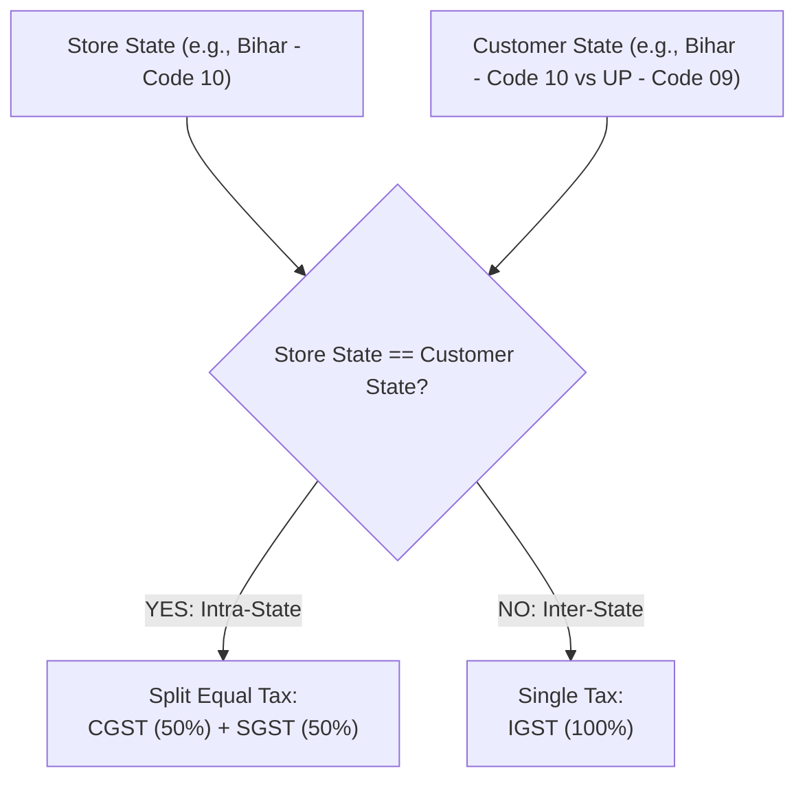
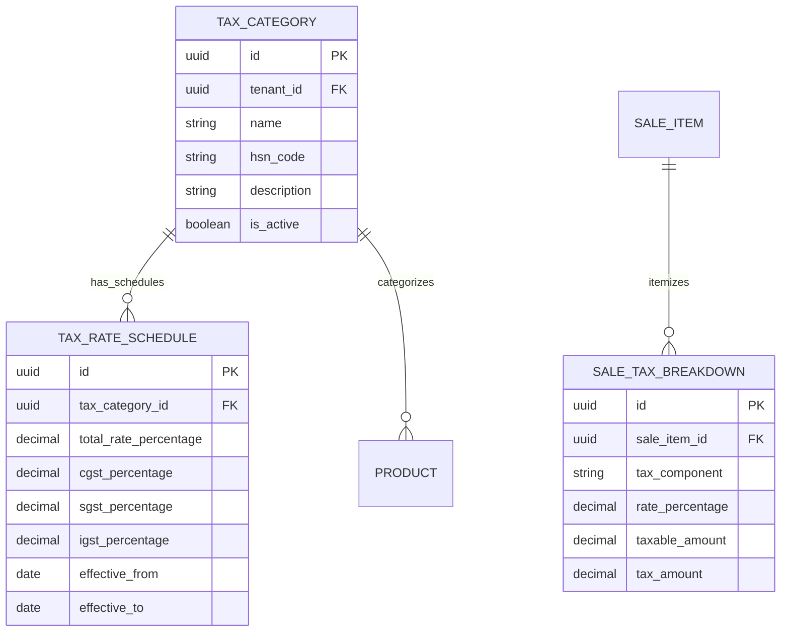

# Domain: Configurable GST & Tax Engine

**Document Version:** 2.0.0  
**Phase:** Phase 1 — Product Definition & Business Requirements  
**Domain Code:** `12-TAX-GST`  
**Status:** Approved Specification (DEC-016 Approved)  

---

## 1. Regulatory & Architectural Principles

> [!IMPORTANT]
> **Configurable Rule Engine Over Hard-Coded Tax Rates**  
> Tax laws and schedules change over time. Super Optical V2 strictly **forbids** hard-coding static tax percentages (e.g. `price * 0.18`) into business checkout logic.  
> All taxes are calculated via a date-effective, category-driven tax engine encapsulated in `@super-optical/tax`.

---

## 2. Indian Goods and Services Tax (GST) Architecture

### 2.1 Intra-State vs Inter-State Resolution
The tax engine determines the tax composition based on store location and customer delivery/billing address:

- **Intra-State Sale (Store State == Customer State):** Tax is divided equally into **Central GST (CGST)** and **State GST (SGST)**.  
  *(Example: 5% total GST $\rightarrow$ 2.5% CGST + 2.5% SGST)*
- **Inter-State Sale (Store State $\neq$ Customer State):** Tax is charged as **Integrated GST (IGST)**.  
  *(Example: 5% total GST $\rightarrow$ 5% IGST)*

---

## 3. Optical Tax Schedules & HSN Classifications (DEC-016)

The tax engine is initialized with Indian optical standard default schedules while remaining fully admin-configurable:

| HSN Code | Description | Default Optical Products | Default GST Rate | Tax Breakdown (Intra-State) | Admin Configurable? |
|:---:|:---|:---|:---:|:---:|:---:|
| `9003` | Spectacle frames and mountings | Optical frames, spectacle mountings, frame parts | **5%** | 2.5% CGST + 2.5% SGST | Yes |
| `9001` | Spectacle lenses & contact lenses | Single vision, bifocal, progressive ophthalmic lenses, contact lenses | **5%** | 2.5% CGST + 2.5% SGST | Yes |
| `9004` | Corrective spectacles | Assembled corrective vision spectacles | **5%** | 2.5% CGST + 2.5% SGST | Yes |
| `9004` | Non-corrective sunglasses | Fashion sunglasses, cosmetic non-powered eyewear | **18%** | 9.0% CGST + 9.0% SGST | Yes (Tenant Configurable) |
| `3307` | Contact lens solutions | Multi-purpose lens disinfecting and lubricating solutions | **18%** | 9.0% CGST + 9.0% SGST | Yes |
| `9983` | Professional clinical optometry | Clinical eye refraction examination | **FREE (₹0)** | Non-Taxable / Free Service | Not a sale line item |

> [!NOTE]
> **Clinical Eye Test Billing Policy (DEC-016):**  
> Clinical eye refraction testing is treated as a **free healthcare service (Price = ₹0)**. It creates clinical refraction records, visual acuity charts, and optical prescriptions, but does not incur service charges or GST.

---

## 4. Entity Architecture for Configurable Tax

---

## 5. Tax Computation & Historical Snapshot Preservation

1. **Date-Effective Rate Resolution:** When calculating taxes at POS checkout, the system looks up the active schedule where:
   $$\text{effective\_from} \le \text{transaction\_date} \le \text{effective\_to}$$
2. **Immutable Snapshot on Invoice:**
   - Once an invoice is confirmed, tax components (`cgst_amount`, `sgst_amount`, `igst_amount`, `rate_applied`, `hsn_code`) are immutably copied directly onto the `sale_items` and `sale_tax_breakdowns` tables.
   - Future modifications to tax categories or national GST revisions will **never alter historical invoices** or retroactively change past tax liabilities.
3. **Tax Inclusive vs Exclusive Calculations:**
   - Retail optical display prices are typically tax-inclusive. The engine extracts the base taxable value deterministically:
     $$\text{Taxable Value} = \text{Round}\left(\frac{\text{Gross Price}}{1 + \text{Tax Rate}}, 2\right)$$
     $$\text{Total Tax} = \text{Gross Price} - \text{Taxable Value}$$
