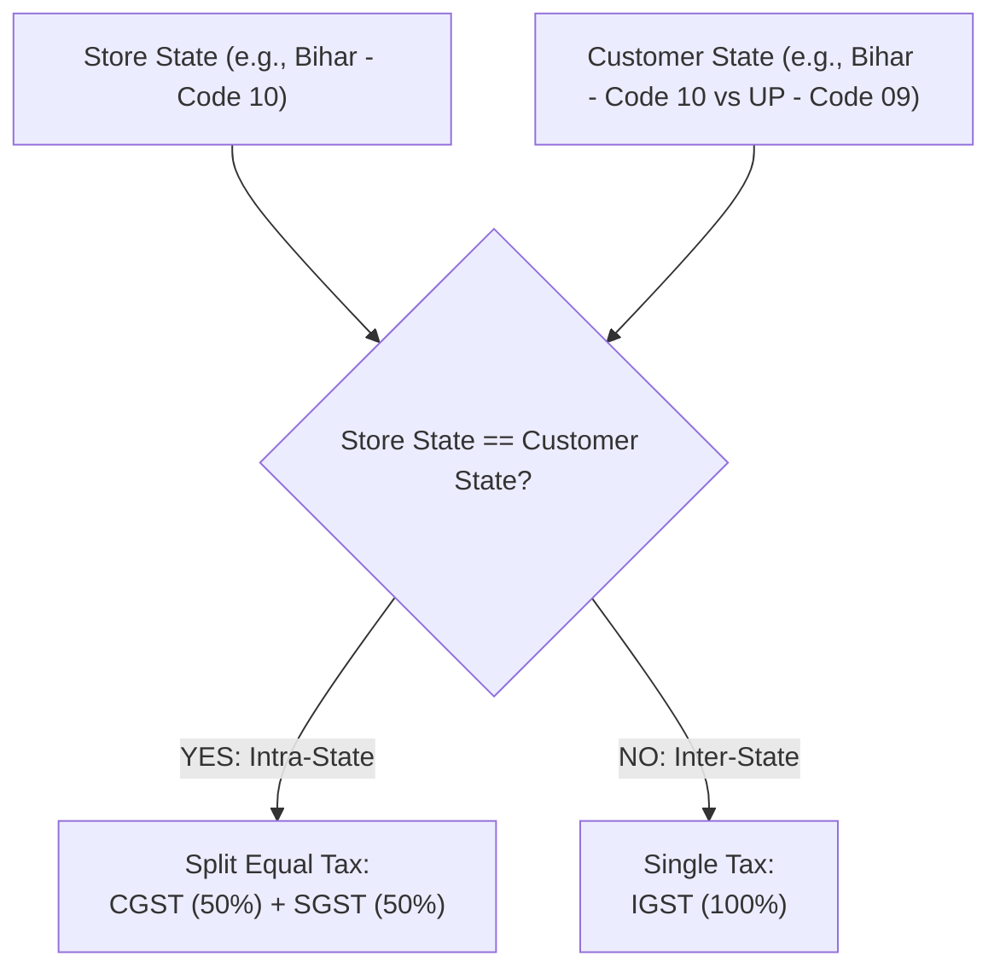
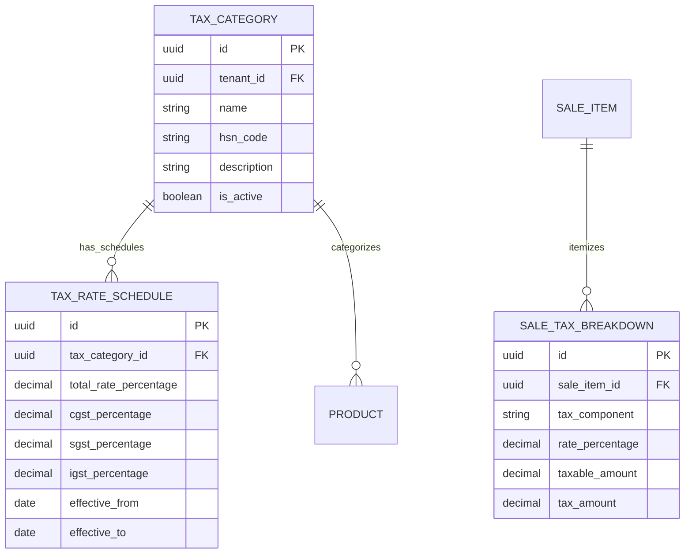

# Domain: Configurable GST & Tax Engine

**Document Version:** 1.0.0  
**Phase:** Phase 1 — Product Definition & Business Requirements  
**Domain Code:** `12-TAX-GST`  

---

## 1. Regulatory & Architectural Principles

> [!IMPORTANT]
> **Configurable Rule Engine Over Hard-Coded Tax Rates**  
> Tax laws change over time. Super Optical V2 strictly **forbids** hard-coding static tax percentages (e.g. `price * 0.18`) into business checkout logic.  
> All taxes are calculated via a date-effective, category-driven tax engine encapsulated in `@super-optical/tax`.

---

## 2. Indian Goods and Services Tax (GST) Architecture

### 2.1 Intra-State vs Inter-State Resolution
The tax engine determines the tax composition based on store location and customer delivery/billing address:

- **Intra-State Sale (Store State == Customer State):** Tax is divided equally into **Central GST (CGST)** and **State GST (SGST)**.  
  *(Example: 12% total GST $\rightarrow$ 6% CGST + 6% SGST)*
- **Inter-State Sale (Store State $\neq$ Customer State):** Tax is charged as **Integrated GST (IGST)**.  
  *(Example: 12% total GST $\rightarrow$ 12% IGST)*

---

## 3. Optical Tax Schedules & HSN Classifications

> [!NOTE]
> **Legal Tax Schedule Verification: Subject to Business/Legal Confirmation**  
> While the engine is fully configurable, default Indian optical HSN mappings are initialized as:

| HSN Code | Description | Default Optical Products | Standard GST Rate (Configurable) |
|:---:|:---|:---|:---:|
| `9003` | Frames and mountings for spectacles | Spectacle frames, spectacle mountings, parts | $12\%$ (6% CGST + 6% SGST) |
| `9001` | Contact lenses & spectacle lenses | Single vision, bifocal, progressive ophthalmic lenses | $12\%$ (6% CGST + 6% SGST) |
| `9004` | Corrective / protective sunglasses | Non-corrective fashion sunglasses | $18\%$ (9% CGST + 9% SGST) |
| `3307` | Contact lens solutions | Multi-purpose disinfecting lens solutions | $18\%$ (9% CGST + 9% SGST) |
| `9983` | Professional healthcare / optometry service | Eye examination fee (exempt in certain jurisdictions) | $0\%$ / Exempt |

---

## 4. Entity Architecture for Configurable Tax

---

## 5. Tax Computation & Invoice Breakdown

1. **Date-Effective Rate Resolution:** When calculating taxes, the system looks up the schedule where:
   $$\text{effective\_from} \le \text{Sale Date} \le \text{effective\_to}$$
2. **Itemized Fiscal Invoicing:** Tax invoices print an explicit GST summary table:
   - Line items grouped by HSN code.
   - Total taxable amount per HSN.
   - Exact CGST, SGST, and IGST currency amounts.
3. **Statutory GSTR-1 Reporting:** Exports standardized JSON/CSV formats categorizing B2B sales (with customer GSTIN) and B2C sales (B2C Large vs B2C Small) matching Indian GST portal upload formats.
