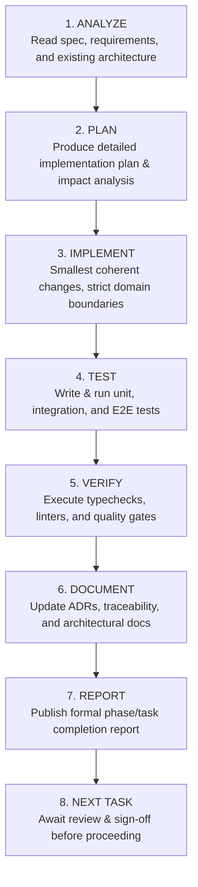

# Super Optical V2 — Development Workflow & Execution Protocol

This document establishes the mandatory engineering protocol for all AI agents, senior engineers, and contributors working on Super Optical V2.

---

## 1. The Standard 8-Step Engineering Loop

Every phase, feature, bug fix, or refactoring task must execute sequentially through the 8-step engineering loop:

---

## 2. Step-by-Step Requirements

### Step 1: ANALYZE
- Read `SUPER_OPTICAL_V2_ANTIGRAVITY_MASTER_BUILD_SPEC.md` and relevant documents in `docs/architecture/` and `docs/domain/`.
- Search the codebase to identify existing patterns, types, and dependencies.
- Identify affected database tables, APIs, and shared packages.
- If requirements are ambiguous or contradictory, document them in `docs/requirements/assumptions-register.md` before coding.

### Step 2: PLAN
- Before altering code, state:
  - Objective of the task
  - Affected monorepo packages/files
  - Database schema migrations or changes
  - API endpoint modifications
  - Potential architectural risks
  - Verification & test strategy

### Step 3: IMPLEMENT
- Implement the smallest coherent change that fulfills the requirements.
- Never write monolithic files (no `storage.js`, `api.js`, or multi-thousand line utility dumps).
- Place shared business calculations exclusively in `packages/`.
- Never create fake or mock shortcuts to make a feature appear complete.

### Step 4: TEST
- Financial calculations, optical formulas, and tax rules must have unit tests with 100% path coverage.
- Backend services mutating data must have transactional integration tests verifying rollback behavior on failure.
- Offline mutations must be tested against simulated network partitions and duplicate command submissions.

### Step 5: VERIFY
- Execute TypeScript typechecking across all workspaces (`npm run typecheck`).
- Execute code style and linting checks (`npm run lint`).
- Execute all relevant test suites (`npm test`).
- Ensure no test is skipped, muted, or mocked unrealistically.

### Step 6: DOCUMENT
- Update `docs/requirements/requirements-traceability.md` to map new implementation files and tests to requirement IDs.
- Record any new architectural decision in `docs/decisions/decision-log.md`.
- Keep API schemas and domain boundary docs synchronized with code changes.

### Step 7: REPORT
- Generate a formal completion report stating:
  - Task objective
  - Files created, modified, or deleted
  - Database migrations added
  - APIs added or updated
  - Test suites executed and pass rates
  - Remaining risks or pending decisions

### Step 8: NEXT TASK
- Tag or commit the working state.
- Do NOT prematurely advance to the next phase without explicit user confirmation.

---

## 3. Git Commit & Branching Discipline

1. **Commit Messages**: Follow Conventional Commits format:
   - `feat(sales): add split-payment allocation logic`
   - `fix(inventory): prevent negative inventory on stock transfer`
   - `docs(decisions): record DEC-011 state management selection`
   - `test(tax): add GST intra-state vs inter-state test cases`
2. **Never Commit Secrets**: Any commit containing API keys, private certificates, or real credentials will be rejected.
