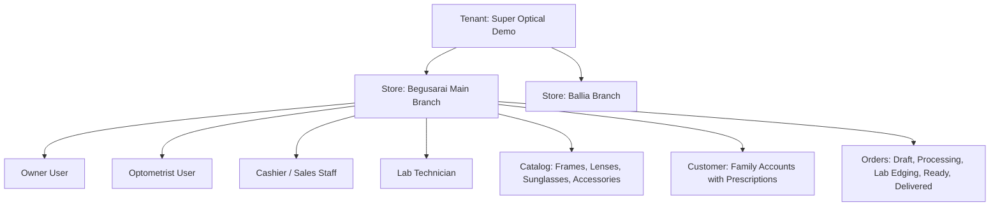
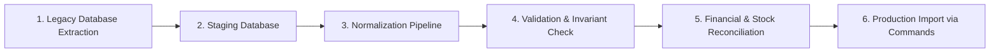

# Super Optical V2 — Environment Strategy & Configuration Management

This document defines the environment separation lifecycle, configuration management rules, secrets handling, and seed data strategy for Super Optical V2.

---

## 1. Environment Topology

Super Optical V2 maintains four strictly isolated environments:

| Environment | Purpose | Target Database | Seed Data | Offline Sync Target |
|:---|:---|:---|:---|:---|
| **Local** | Developer workstation & local testing | Local PostgreSQL (Docker) | Demo optical store (Begusarai & Ballia) | Local mock sync endpoint |
| **Development (Dev)** | Continuous integration & agent test runner | Isolated Dev PostgreSQL RDS/CloudSQL | Automated regression test fixtures | Development API cluster |
| **Staging** | Pre-production UAT, performance & migration validation | Staged snapshot of sanitized production schema | Sanitized historical migration dataset | Staging sync cluster |
| **Production** | Live SaaS operations across all tenants | Multi-AZ High-Availability PostgreSQL with read replicas | Production customer & tenant data only | Production sync cluster |

---

## 2. Secrets Management & Configuration Rules

1. **No Hardcoded Secrets**: Secrets, private keys, database passwords, or JWT keys must NEVER be committed to Git.
2. **Environment Variable Injection**:
   - In Local development: Loaded from `.env` (derived from `.env.example`).
   - In Staging/Production: Injected securely at container runtime via cloud secret managers (e.g. AWS Secrets Manager, GCP Secret Manager, or HashiCorp Vault).
3. **Template Parity**: Any new environment variable introduced to application code must simultaneously be added to `.env.example` with descriptive placeholder text.

---

## 3. Seed Data Strategy

For local development and automated CI testing, the system provides realistic seed fixtures representing standard optical workflows:

Seed scripts are strictly located in `database/seeds/` and can never run against an environment where `NODE_ENV === 'production'`.

---

## 4. Legacy Data Migration Strategy

As established in Section 30 of the Master Specification, legacy data will NOT be directly injected into production PostgreSQL tables. The migration follows a 6-stage ETL pipeline:

- **Extraction**: Read-only dump of legacy tables.
- **Staging**: Unpack unnormalized `invoice_snapshot` JSON strings and resolve duplicate customer phone numbers.
- **Normalization**: Map old records into relational `customers`, `products`, `sales`, and `payments`.
- **Validation**: Verify that historical sales reconcile with payment records.
- **Production Import**: Ingest historical records tagged with `MIGRATED_LEGACY` flags to preserve audit integrity.
