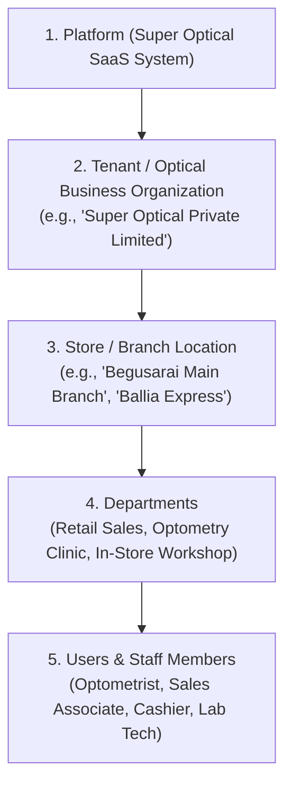
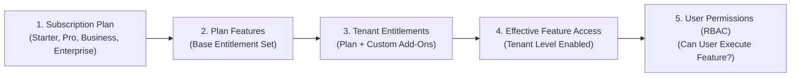

# Super Optical V2 — Business Model & Multi-Tenant Operating Structure

**Document Version:** 2.0.0  
**Phase:** Phase 1 — Product Definition & Business Requirements  
**Status:** Approved Architectural Model (DEC-015 Approved)  

---

## 1. Five-Tier Organizational Hierarchy

Super Optical V2 models optical retail organizations through a strict five-tier structural hierarchy:

---

## 2. Structural Tiers Defined

### 2.1 Tier 1: Platform
- **Scope:** The overarching multi-tenant SaaS application platform managed by the SaaS owner.
- **Responsibilities:** Tenant provisioning, subscription plan governance, billing metrics, database tenancy infrastructure, global configuration.

### 2.2 Tier 2: Tenant (Optical Business)
- **Scope:** An independent legal business entity, optical retail chain, or private optometry practice.
- **Responsibilities:** Owns customer master records, centralized product catalog, brand partnerships, supplier contracts, accounting ledgers, and staff roster.
- **Isolation:** Absolute data boundary. Tenant data is isolated in PostgreSQL via Row-Level Security (RLS). A user in Tenant A cannot see Tenant B's data under any condition.

### 2.3 Tier 3: Store / Branch
- **Scope:** A physical retail location or optical dispensing center operated by a tenant.
- **Responsibilities:** Holds physical stock inventory (`store_inventory`), operates POS cash registers, logs localized sales, handles customer collections, and manages local staff shifts.
- **Isolation:** Users are assigned explicit store access. A cashier in Store A cannot open registers or process sales in Store B unless explicitly granted multi-store roaming permissions.

### 2.4 Tier 4: Department
- **Scope:** Functional divisions within a store or centralized hub:
  - **Retail Showroom / Front Desk:** Customer reception, frame try-on, styling, accessory sales.
  - **Optometry Clinic:** Free visual acuity testing, auto-refraction, trial lens testing, clinical prescription writing.
  - **Workshop / Edging Lab:** In-store lens cutting, beveling, frame grooving, fitting, and inspection.
  - **Warehouse / Stockroom:** Bulk stock intake, supplier returns, inter-branch dispatch.

### 2.5 Tier 5: Users
- **Scope:** Individual staff members authenticated with secure credentials.
- **Role Binding:** Bound to a tenant and assigned roles (`Store Manager`, `Optometrist`, `Cashier`, etc.) with explicit store memberships.

---

## 3. Operational Models Supported

### 3.1 Single-Store Operation (Independent Practice)
- **Topology:** 1 Tenant $\rightarrow$ 1 Store $\rightarrow$ Multi-User.
- **Workflow:** Owner acts as manager and cashier; optometrist records free eye examinations and prescriptions; lens fitting done in-house or outsourced to external labs.

### 3.2 Multi-Store Operation (Retail Chain)
- **Topology:** 1 Tenant $\rightarrow$ Multiple Stores ($N \ge 2$) $\rightarrow$ Centralized Warehouse / Central Optical Lab.
- **Workflow:** Centralized product catalog shared across all stores; inventory is tracked per store; inter-store stock transfers require formal two-phase dispatch and receipt; orders placed at Store A can be processed at Central Lab and dispatched to Store A for customer delivery.

---

## 4. SaaS Commercial & Subscription Model

> [!IMPORTANT]
> **Subscription Tiers & Entitlements Approved (DEC-015)**  
> Commercial pricing figures are not hard-coded in source code or database schemas. Subscription plans configure feature entitlements, resource limits, and billing intervals (monthly/annual).

### Canonical Subscription Tiers:
1. **Starter Plan:** Designed for independent single-counter optical practices. Core POS, free clinical eye tests, prescriptions, single-store inventory, and basic sales reporting.
2. **Professional Plan:** Designed for established single stores with in-house edging workshops, customer credit/debit accounts, supplier procurement, and offline-first counter resilience.
3. **Business Plan:** Designed for expanding multi-store optical chains requiring inter-store stock transfers, centralized warehouse routing, and consolidated multi-branch financial reports.
4. **Enterprise Plan:** Designed for large regional optical retail networks, optical franchises, or wholesale lab integrations requiring external APIs, custom integrations, and dedicated audit retention.

---

## 5. Entitlement Architecture

The entitlement engine enforces multi-tier feature governance using a hierarchical resolution chain:

### Entitlement Enforcement Rules:
1. **Plan Inheritance:** A tenant acquires the baseline feature bundle of their subscribed plan.
2. **Tenant Add-On Overrides:** A tenant may be granted specific add-on feature entitlements (e.g., `OFFLINE_POS` on Starter) without changing the core plan tier.
3. **Two-Stage Authorization:**
   - Stage 1 (Tenant Level): System checks if `tenant.hasFeature(FEATURE_KEY)`. If false, endpoint throws `403 Feature Not Subscribed`.
   - Stage 2 (User Level): System checks if `user.hasPermission(PERMISSION_CODE)`. If false, endpoint throws `403 Forbidden`.
4. **Grace Period & Limit Handling:** When a plan usage limit is approached (e.g., 90% of user quota), non-blocking alerts are sent. When exceeded, creation is blocked until upgrade.

---

## 6. Canonical Feature Catalog

The canonical feature catalog defines the authoritative, unique feature identifiers for Super Optical V2:

| Feature Key | Feature Name | Description | Domain Area | Implementation Area |
|:---|:---|:---|:---:|:---:|
| `CUSTOMER_MANAGEMENT` | Customer Management | Customer profiles, contact numbers, optical history, communication preferences | `01-CUSTOMER` | `backend/api/customers` |
| `FAMILY_MANAGEMENT` | Family Grouping | Linking dependent family members under primary customer account | `01-CUSTOMER` | `backend/api/customers` |
| `EYE_TEST` | Clinical Eye Refraction | Refraction examinations, visual acuity, trial lens testing (Free service ₹0) | `08-CLINICAL` | `packages/optical`, `backend/api/clinical` |
| `PRESCRIPTION` | Optical Prescriptions | Digital prescription authoring, SPH/CYL/AXIS/ADD, printable Rx card | `09-PRESCRIPTION` | `packages/optical`, `backend/api/prescriptions` |
| `PRODUCT_CATALOG` | Product Master & Variants | Frames, ophthalmic lenses, sunglasses, contact lenses, accessories | `10-PRODUCT-CATALOG` | `backend/api/products` |
| `PRICING` | Pricing & Discount Engine | Deterministic MRP, retail pricing, wholesale prices, discount controls | `11-PRICING` | `packages/calculations`, `backend/api/pricing` |
| `INVENTORY` | Store Inventory Ledgers | Append-only inventory movements, stock on hand, reservations | `13-INVENTORY` | `packages/types`, `backend/api/inventory` |
| `ADVANCED_INVENTORY` | Advanced Stock & Exceptions | Cycle counting, barcode generation, emergency negative inventory exception | `13-INVENTORY` | `backend/api/inventory` |
| `PROCUREMENT` | Purchase Orders & GRN | Vendor purchase orders, goods receipt notes, supplier invoices | `14-PROCUREMENT` | `backend/api/procurement` |
| `SUPPLIERS` | Supplier Management | Optical frame/lens vendor master, supplier accounts, lead times | `14-PROCUREMENT` | `backend/api/procurement` |
| `POS` | Point of Sale Counter | Fast checkout, barcode scanning, cart assembly, lens pairing | `15-POS` | `apps/web`, `apps/desktop` |
| `QUOTATION` | Estimates & Quotations | Creating, printing, and converting customer quotations to sales | `15-POS` | `backend/api/sales` |
| `SALES` | Sales Order Management | Sales order tracking, revision-based modifications, customer pickup | `16-SALES` | `backend/api/sales` |
| `INVOICE` | Tax Invoicing & Credit Notes | GST compliant tax invoices, thermal slips, credit notes, revisions | `16-SALES` | `packages/printing`, `backend/api/invoicing` |
| `PAYMENTS` | Multi-Tender Payments | Cash, UPI, Card, NetBanking split payments and ledger allocations | `17-PAYMENTS` | `backend/api/payments` |
| `REFUNDS` | Refund Processing | Supervisor-authorized transaction refunds and reversals | `17-PAYMENTS` | `backend/api/payments` |
| `CUSTOMER_CREDIT` | Customer Credit Ledger | Store credit balances, deposit ledgers, advance payment handling | `18-CREDIT-DEBIT` | `backend/api/finance` |
| `CUSTOMER_DEBIT` | Customer Receivables | Outstanding customer balances, partial payment credit tracking | `18-CREDIT-DEBIT` | `backend/api/finance` |
| `GST_TAX` | Configurable GST Engine | Intra/inter-state tax resolution, optical HSN schedules, tax snapshots | `12-TAX-GST` | `packages/tax`, `backend/api/tax` |
| `OPTICAL_LAB` | Optical Workshop & Lab | Edging job tickets, lens fitting, bifocal/progressive beveling, QC | `19-OPTICAL-LAB` | `backend/api/lab` |
| `DELIVERY` | Order Delivery & Handover | Fitting verification, customer handover, balance collection | `20-DELIVERY` | `backend/api/delivery` |
| `CASH_REGISTER` | Cash Register Management | Opening float, cash drawer reconciliation, denomination close (₹500 variance) | `24-CASH-REGISTER` | `backend/api/cash-register` |
| `EXPENSES` | Store Petty Cash Expenses | Cash drawer payouts for store operational expenses and refreshments | `25-EXPENSES` | `backend/api/expenses` |
| `REPORTS_BASIC` | Basic Operational Reports | Daily sales, cash session balance, tax summary, stock listing | `26-REPORTS` | `backend/api/reports` |
| `REPORTS_ADVANCED` | Advanced Business Analytics | Gross margin reports, optometrist conversion, slow-moving frame analysis | `26-REPORTS` | `backend/api/reports` |
| `CENTRAL_REPORTING` | Chain-Wide Central Reports | Multi-store consolidated revenue, inter-store transfer reconciliations | `26-REPORTS` | `backend/api/reports` |
| `MULTI_STORE` | Multi-Store Operations | Multi-branch routing, two-phase stock transfers, branch switching | `28-MULTI-STORE` | `backend/api/multi-store` |
| `USER_MANAGEMENT` | Staff & User Management | Employee accounts, branch allocations, credential administration | `27-ROLES-PERMISSIONS` | `backend/api/users` |
| `RBAC` | Role-Based Access Control | Granular permission trees, store boundaries, role assignments | `27-ROLES-PERMISSIONS` | `backend/api/auth` |
| `OFFLINE_POS` | Offline POS & Edge Sync | IndexedDB caching, offline sales, background sync queue, conflict handling | `29-OFFLINE-SYNC` | `packages/sync`, `apps/desktop` |
| `HARDWARE` | Optical Hardware Drivers | ESC/POS thermal printers, barcode scanners, cash drawers | `30-HARDWARE` | `packages/printing`, `apps/desktop` |
| `NOTIFICATIONS` | Customer Notifications | WhatsApp & SMS order readiness alerts, prescription sharing | `31-NOTIFICATIONS` | `backend/api/notifications` |
| `AUDIT` | Immutable Audit Trail | Security events, clinical alterations, stock overrides, cash variances | `32-AUDIT` | `backend/api/audit` |
| `API_INTEGRATION` | External REST & Webhooks | Third-party ERP connectors, webhook event dispatching, accounting export | `00-PLATFORM` | `backend/api` |
| `TENANT_ADMINISTRATION` | Tenant Administration | Plan management, store provisioning, tax schedule setup, system configuration | `00-PLATFORM` | `backend/api/admin` |

---

## 7. Canonical SaaS Plan-Feature Matrix

The matrix below defines feature inclusions across all four canonical subscription tiers:

| Feature Key | Starter Plan | Professional Plan | Business Plan | Enterprise Plan |
|:---|:---:|:---:|:---:|:---:|
| `CUSTOMER_MANAGEMENT` | Yes | Yes | Yes | Yes |
| `FAMILY_MANAGEMENT` | Yes | Yes | Yes | Yes |
| `EYE_TEST` | Yes | Yes | Yes | Yes |
| `PRESCRIPTION` | Yes | Yes | Yes | Yes |
| `PRODUCT_CATALOG` | Yes | Yes | Yes | Yes |
| `PRICING` | Yes | Yes | Yes | Yes |
| `INVENTORY` | Yes | Yes | Yes | Yes |
| `ADVANCED_INVENTORY` | No | No | Yes | Yes |
| `PROCUREMENT` | No | Yes | Yes | Yes |
| `SUPPLIERS` | No | Yes | Yes | Yes |
| `POS` | Yes | Yes | Yes | Yes |
| `QUOTATION` | Yes | Yes | Yes | Yes |
| `SALES` | Yes | Yes | Yes | Yes |
| `INVOICE` | Yes | Yes | Yes | Yes |
| `PAYMENTS` | Yes | Yes | Yes | Yes |
| `REFUNDS` | Yes | Yes | Yes | Yes |
| `CUSTOMER_CREDIT` | No | Yes | Yes | Yes |
| `CUSTOMER_DEBIT` | No | Yes | Yes | Yes |
| `GST_TAX` | Yes | Yes | Yes | Yes |
| `OPTICAL_LAB` | No | Yes | Yes | Yes |
| `DELIVERY` | Yes | Yes | Yes | Yes |
| `CASH_REGISTER` | Yes | Yes | Yes | Yes |
| `EXPENSES` | Yes | Yes | Yes | Yes |
| `REPORTS_BASIC` | Yes | Yes | Yes | Yes |
| `REPORTS_ADVANCED` | No | Yes | Yes | Yes |
| `CENTRAL_REPORTING` | No | No | Yes | Yes |
| `MULTI_STORE` | No | No | Yes | Yes |
| `USER_MANAGEMENT` | Yes | Yes | Yes | Yes |
| `RBAC` | Yes | Yes | Yes | Yes |
| `OFFLINE_POS` | No | Yes | Yes | Yes |
| `HARDWARE` | Yes | Yes | Yes | Yes |
| `NOTIFICATIONS` | No | Yes | Yes | Yes |
| `AUDIT` | Yes | Yes | Yes | Yes |
| `API_INTEGRATION` | No | No | No | Yes |
| `TENANT_ADMINISTRATION` | Yes | Yes | Yes | Yes |

---

## 8. Feature Dependencies

Every dependent feature strictly references valid upstream features defined in the Canonical Feature Catalog:

| Feature Key | Dependent On | Dependency Rationale |
|:---|:---|:---|
| `FAMILY_MANAGEMENT` | `CUSTOMER_MANAGEMENT` | Family members link to an existing primary customer profile |
| `EYE_TEST` | `CUSTOMER_MANAGEMENT` | Eye tests are conducted on registered customers or family members |
| `PRESCRIPTION` | `EYE_TEST`, `CUSTOMER_MANAGEMENT` | Optical prescription requires examination measurements and customer identity |
| `PRICING` | `PRODUCT_CATALOG` | Pricing rules attach directly to catalog product variants |
| `ADVANCED_INVENTORY` | `INVENTORY` | Cycle counting and stock variance adjust existing inventory movements |
| `PROCUREMENT` | `SUPPLIERS`, `INVENTORY` | POs require vendor records and intake units into inventory ledgers |
| `POS` | `PRODUCT_CATALOG`, `CUSTOMER_MANAGEMENT` | Counter sales require product catalog selection and customer assignment |
| `QUOTATION` | `POS` | Quotation workflow uses the POS cart pricing engine |
| `SALES` | `POS`, `INVENTORY` | Confirmed sales originate from cart and reserve inventory stock |
| `INVOICE` | `SALES`, `GST_TAX` | Invoices generate from sales orders and compute date-effective GST |
| `PAYMENTS` | `SALES` | Payments allocate directly to confirmed sales order invoices |
| `REFUNDS` | `PAYMENTS` | Refunds require prior payment transactions to reverse or credit |
| `CUSTOMER_CREDIT` | `PAYMENTS`, `CUSTOMER_MANAGEMENT` | Excess payments or credit notes credit to customer master account |
| `CUSTOMER_DEBIT` | `SALES`, `CUSTOMER_MANAGEMENT` | Partial payments create customer receivable debit balances |
| `OPTICAL_LAB` | `SALES`, `PRESCRIPTION` | Workshop job tickets require confirmed sales items and prescription data |
| `DELIVERY` | `SALES` | Delivery fulfillment hands over confirmed spectacle sales orders |
| `CASH_REGISTER` | `PAYMENTS` | Cash sessions reconcile counter cash payment transactions |
| `EXPENSES` | `CASH_REGISTER` | Store petty cash disbursements deduct from active cash drawer session |
| `REPORTS_BASIC` | `SALES`, `PAYMENTS` | Basic operational reports summarize daily sales orders and payments |
| `REPORTS_ADVANCED` | `REPORTS_BASIC`, `INVENTORY` | Advanced analytics combine sales margins with inventory movement data |
| `CENTRAL_REPORTING` | `REPORTS_ADVANCED`, `MULTI_STORE` | Consolidated chain reports aggregate analytics across multiple branches |
| `MULTI_STORE` | `INVENTORY`, `USER_MANAGEMENT` | Multi-store routing requires inter-branch inventory and multi-store staff |
| `RBAC` | `USER_MANAGEMENT` | Role permissions assign directly to user accounts |
| `OFFLINE_POS` | `POS`, `PAYMENTS` | Offline counter caches POS cart logic and payment capture |
| `HARDWARE` | `POS` | Receipt printing and drawer kick trigger from POS checkout actions |
| `NOTIFICATIONS` | `CUSTOMER_MANAGEMENT` | Automated alerts route to customer mobile numbers |
| `AUDIT` | `USER_MANAGEMENT` | Immutable audit log records attributing user accounts |
| `API_INTEGRATION` | `TENANT_ADMINISTRATION` | External API tokens and webhooks configure in tenant administration |
| `TENANT_ADMINISTRATION` | `RBAC` | Administrative configuration restricted by role-based access control |

---

## 9. Configurable Plan Limits

Plan limits govern tenant resource usage and enforce tier boundaries:

| Limit Parameter | Description | Starter Plan | Professional Plan | Business Plan | Enterprise Plan |
|:---|:---|:---:|:---:|:---:|:---:|
| `MAX_STORES` | Number of physical store branches | 1 | 1 | 5 | Unlimited |
| `MAX_USERS` | Active staff accounts across tenant | 3 | 8 | 25 | Unlimited |
| `MAX_DEVICES_PER_STORE` | Simultaneous active POS/counter terminals | 2 | 5 | 10 | Unlimited |
| `MAX_PRODUCTS` | Product variants in catalog | 2,000 | 10,000 | 50,000 | Unlimited |
| `MAX_MONTHLY_INVOICES` | Sales invoices generated per calendar month | 500 | 2,500 | 15,000 | Unlimited |
| `MAX_STORAGE_GB` | Document and attachment storage (Rx scans) | 5 GB | 25 GB | 100 GB | 500+ GB |
| `OFFLINE_SYNC_ENABLED` | Offline counter resilience and local caching | Disabled | Enabled | Enabled | Enabled |
| `AUDIT_RETENTION_DAYS` | Retention window for immutable audit logs | 90 days | 365 days (1 yr) | 1,095 days (3 yr) | 2,555 days (7 yr) |
