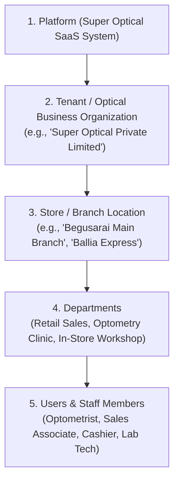

# Super Optical V2 — Business Model & Multi-Tenant Operating Structure

**Document Version:** 1.0.0  
**Phase:** Phase 1 — Product Definition & Business Requirements  
**Status:** Approved Architectural Model  

---

## 1. Five-Tier Organizational Hierarchy

Super Optical V2 models optical retail organizations through a strict five-tier structural hierarchy:

---

## 2. Structural Tiers Defined

### 2.1 Tier 1: Platform
- **Scope:** The overarching multi-tenant SaaS application platform managed by the SaaS owner.
- **Responsibilities:** Tenant provisioning, system-wide health monitoring, billing metrics, database tenancy infrastructure, global configuration.

### 2.2 Tier 2: Tenant (Optical Business)
- **Scope:** An independent legal business entity, optical retail chain, or private optometry practice.
- **Responsibilities:** Owns customer master records, centralized product catalog, brand partnerships, supplier contracts, accounting ledgers, and staff roster.
- **Isolation:** Absolute data boundary. Tenant data is isolated in PostgreSQL via Row-Level Security (RLS). A user in Tenant A cannot see Tenant B's data under any condition.

### 2.3 Tier 3: Store / Branch
- **Scope:** A physical retail location or optical dispensing center operated by a tenant.
- **Responsibilities:** Holds physical stock inventory (`store_inventory`), operates POS cash registers, logs localized sales, handles customer collections, and manages local staff shifts.
- **Isolation:** Users are assigned explicit store access. A cashier in Store A cannot open registers or process sales in Store B unless explicitly granted multi-store roaming permissions.

### 2.4 Tier 4: Department
- **Scope:** Functional divisions within a store or centralized hub:
  - **Retail Showroom / Front Desk:** Customer reception, frame try-on, styling, accessory sales.
  - **Optometry Clinic:** Visual acuity testing, auto-refraction, trial lens testing, clinical prescription writing.
  - **Workshop / Edging Lab:** In-store lens cutting, beveling, frame grooving, fitting, and inspection.
  - **Warehouse / Stockroom:** Bulk stock intake, supplier returns, inter-branch dispatch.

### 2.5 Tier 5: Users
- **Scope:** Individual staff members authenticated with secure credentials.
- **Role Binding:** Bound to a tenant and assigned roles (`Store Manager`, `Optometrist`, `Cashier`, etc.) with explicit store memberships.

---

## 3. Operational Models Supported

### 3.1 Single-Store Operation (Independent Practice)
- **Topology:** 1 Tenant $\rightarrow$ 1 Store $\rightarrow$ Multi-User.
- **Workflow:** Owner acts as manager and cashier; visiting or in-house optometrist records prescriptions; lens fitting done in-house or outsourced to external wholesale labs.

### 3.2 Multi-Store Operation (Retail Chain)
- **Topology:** 1 Tenant $\rightarrow$ Multiple Stores ($N \ge 2$) $\rightarrow$ Centralized Warehouse / Central Optical Lab.
- **Workflow:** Centralized product catalog shared across all stores; inventory is tracked per store; inter-store stock transfers require formal dispatch and receipt acknowledgement; orders placed at Store A can be processed at Central Lab and dispatched to Store A for customer delivery.

---

## 4. SaaS Commercial & Subscription Model

> [!NOTE]
> **Subscription Pricing Status: PENDING BUSINESS DECISION**  
> In accordance with project instructions, actual commercial subscription pricing figures and tier costs are not assumed and are marked as **PENDING BUSINESS DECISION**.

### Planned Subscription Tiers (Structure Only)
1. **Starter Tier (Single Store):** Designed for independent single-counter practices (1 store, up to 3 users, POS + Clinical + Inventory).
2. **Growth Tier (Multi-Store Chain):** Designed for expanding chains (up to 5 stores, 15 users, Inter-store transfers, Workshop routing, Detailed GST).
3. **Enterprise Tier:** Unlimited stores, custom integrations, centralized optical manufacturing lab routing, dedicated database schema / priority SLA.
