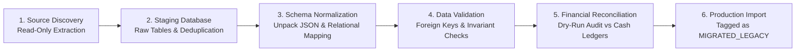

# Super Optical V2 — Legacy Data Migration Requirements

**Document Version:** 1.0.0  
**Phase:** Phase 1 — Product Definition & Business Requirements  
**Target:** Legacy Super Optical System Migration Blueprint (Execution in Phase 14)  

---

## 1. Migration Overview & Strategic Principles

> [!CAUTION]
> **No Direct Database Injection**  
> Legacy Super Optical data must NEVER be directly copied or injected into production PostgreSQL tables.  
> Due to known architectural flaws in the legacy system (unnormalized JSON `invoice_snapshot` blobs, duplicate customer phone numbers, missing inventory movement records), data must pass through a strict 6-stage ETL migration pipeline.

---

## 2. Six-Stage Migration Pipeline

---

## 3. Detailed Migration Requirements

### 3.1 Stage 1: Source Discovery & Data Extraction
- Extract complete read-only SQL dumps from legacy MySQL/SQLite databases without impacting running operations.
- Inventory all source tables: `customers`, `invoices`, `inventory`, `products`, `prescriptions`, `payments`.
- Extract and document historical invoice JSON snapshots.

### 3.2 Stage 2: Staging & Duplicate Resolution
- Load extracted data into an isolated `staging_migration` schema.
- **Customer Phone Number Deduplication:**
  - Detect multiple customer records sharing identical phone numbers.
  - Merge profiles into a single primary Customer account; assign distinct family members where applicable.
  - Resolve invalid phone numbers ($< 10$ digits) into a manual review queue.

### 3.3 Stage 3: Schema Normalization & Entity Mapping
- **Product & Catalog Normalization:**
  - Decouple legacy flat product rows into normalized `products` and `product_variants` (color, size).
  - Assign standardized HSN codes (`9003` for frames, `9001` for lenses).
- **Invoice Snapshot Extraction:**
  - Parse legacy `invoice_snapshot` JSON strings into discrete relational `sale_items` rows.
  - Separate optical frame line items from ophthalmic lens line items.
- **Payment & Allocation Normalization:**
  - Convert legacy `paid_amount` numbers into discrete `payments` transaction records.
  - Create `payment_allocations` linking historical payments to corresponding sales.

### 3.4 Stage 4: Validation & Invariant Auditing
- Verify that every legacy order references a valid customer and store ID.
- Verify that historical line-item subtotals + taxes equal the reported invoice totals within a 1-rupee rounding tolerance.
- Flag any un-reconciled records for manual administrative resolution.

### 3.5 Stage 5: Dry-Run & Reconciliation
- Execute full migration scripts against a Staging database clone.
- Compare pre-migration and post-migration financial metrics:
  - Total historical gross revenue.
  - Total historical customer outstanding balances.
  - Total physical stock quantities on hand.
- Require sign-off from the business accountant before cutover.

### 3.6 Stage 6: Production Cutover & Rollback Strategy
- **Maintenance Window:** Execute final delta import during scheduled store closure (e.g. Sunday night).
- **Audit Tagging:** All migrated historical records are tagged with `is_legacy_migrated: true` and `migration_batch_id: UUID` to preserve audit isolation.
- **Rollback Strategy:** If reconciliation variance exceeds 0.01% during cutover:
  - Roll back production PostgreSQL to the pre-migration snapshot taken immediately prior to import.
  - Leave legacy system operational while resolving ETL script errors.
