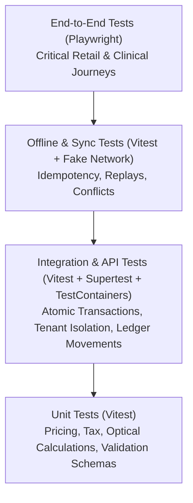

# Super Optical V2 — Testing Strategy & Quality Assurance Architecture

This document defines the testing methodology, automated test suites, quality gates, and the mandatory 20-case invoice test matrix for Super Optical V2.

---

## 1. Prime Testing Principle

> [!IMPORTANT]
> **NO FEATURE IS COMPLETE UNTIL IT HAS ACCEPTANCE CRITERIA AND TEST COVERAGE APPROPRIATE TO ITS RISK.**
> Financial transactions, inventory ledgers, multi-tenant isolation, and offline synchronization require higher test rigor, higher assertion coverage, and deterministic verification than cosmetic UI changes.

---

## 2. Test Pyramid & Automation Levels

### 2.1 Unit Testing Layer (Vitest)
- **Target:** Pure functions, calculation engines, Zod schemas, optical transposition formulas.
- **Rules:** Zero network calls, zero database connections, execution speed $< 5\text{ms}$ per test.
- **Coverage Requirement:** 100% path coverage for `@super-optical/calculations`, `@super-optical/tax`, and `@super-optical/optical`.

### 2.2 Integration Testing Layer (Vitest + PostgreSQL TestContainers)
- **Target:** NestJS services, database repositories, transaction boundaries, and RLS policies.
- **Key Suites:**
  - **Tenant Isolation Test:** Explicitly attempt cross-tenant reads and updates to verify RLS rejection.
  - **Inventory Ledger Test:** Verify that creating a sale decrements stock and creates an immutable movement row with correct balance.
  - **Payment Allocation Test:** Verify split payments, overpayments into customer credits, and partial allocations.

### 2.3 Offline & Synchronization Testing Suite
- **Target:** `@super-optical/sync` and client Dexie command queue.
- **Test Scenarios:**
  - Command queue persistence across simulated page reloads.
  - Idempotency verification: Replaying the identical `command_id` three times must return the cached result without duplicate side-effects.
  - Concurrent stock exhaustion conflict handling.

### 2.4 End-to-End (E2E) Testing (Playwright)
- **Target:** Full web and desktop application workflows.
- **Critical Paths:**
  1. Patient eye test $\rightarrow$ Prescription generation $\rightarrow$ POS checkout with prescription $\rightarrow$ Lab job tracking $\rightarrow$ QC $\rightarrow$ Delivery.
  2. Cash register opening $\rightarrow$ Cash sales $\rightarrow$ Petty cash expense $\rightarrow$ Cash session closing with denomination count.

---

## 3. Mandatory 20-Case Invoice Test Matrix

Before Phase 8 (Invoice Lifecycle) can be signed off, all 20 scenarios below must pass deterministically with zero financial or inventory drift:

| Case # | Test Scenario | Expected Financial Behavior | Expected Inventory Behavior |
|:---:|:---|:---|:---|
| **01** | Create single-item invoice | Accurate subtotal, tax, and balance | 1 item deducted via `SALE_DEDUCTION` |
| **02** | Create multi-item invoice (Frame + Lens + Drops) | Bundled calculation with mixed tax rates | Each variant deducted independently |
| **03** | Add item to confirmed unpaid invoice | Total increased, new revision created | Added variant stock deducted |
| **04** | Remove item from confirmed unpaid invoice | Total decreased, new revision created | Removed variant returned via `SALE_REVERSAL` |
| **05** | Change item quantity (e.g., 1 to 2 boxes) | Total recalculated | Incremental quantity deducted |
| **06** | Change frame model on confirmed invoice | Subtotal adjusted for price difference | Old frame returned, new frame deducted |
| **07** | Change lens type (Standard to Anti-Glare) | Subtotal adjusted, lab job updated | Lens blank stock adjusted |
| **08** | Change prescription parameters only | Zero financial change | Zero stock change; lab job notes updated |
| **09** | Apply manager discount post-confirmation | Subtotal reduced, tax recomputed | Zero stock change |
| **10** | Increase invoice price after full payment | Invoice transitions to `PARTIALLY_PAID` | Zero stock change |
| **11** | Reduce invoice price below amount paid | Excess routed to `customer_credits` | Zero stock change |
| **12** | Issue partial refund on returned item | Refund transaction recorded against payment | Returned item restored via `SALE_REVERSAL` |
| **13** | Issue full refund and cancel order | Full reversal of all allocations | All items restored to inventory |
| **14** | Multi-tender split payment (Cash + UPI + Card) | 3 distinct immutable payment records created | Unchanged |
| **15** | Multi-item order for 2 family members | Single invoice with distinct line-item Rx tags | Respective stocks deducted |
| **16** | Offline edit synced upon reconnection | Validated against aggregate version | Verified against server ledger |
| **17** | Duplicate sync command received | Returns original 200 OK without re-execution | No duplicate stock deduction |
| **18** | Concurrent online and offline edit collision | Triggers `SYNC_CONFLICT` review queue | Locked against double deduction |
| **19** | Order cancelled before optical lab edging | Status $\rightarrow$ `CANCELLED`; payments refunded/credited | All un-edged inventory returned |
| **20** | Post-delivery warranty replacement | Zero-cost replacement invoice created | Replaced frame deducted with reason `WARRANTY` |
